# Operations Manual

AdLimeプラットフォームを通じ、開発者はアプリ内にマネタイズsdkを導入し多様な広告を配信することによって、収益を上げることができます。

## Sign up /Login

### Sign Up

- webページ[https://www.adlime.net/auth/register](https://www.adlime.net/auth/register)を開いてください。
- 登録画面にて、メールアドレスとパスワードを入力し、「サービス利用規約に同意する」にチェックマークを入れて、登録を行ってください。

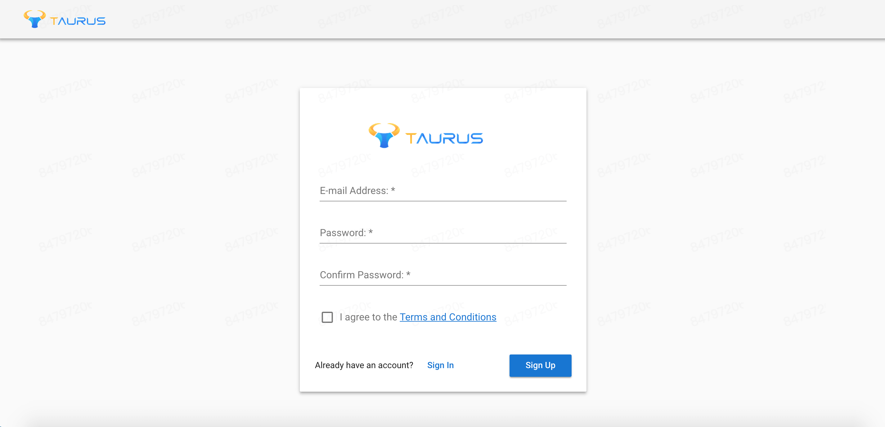

### Login in

- webページ[https://www.adlime.net/auth/login](https://www.adlime.net/auth/login)を開いてください。
- メールアドレスとパスワードを入力し、ログインしてください。

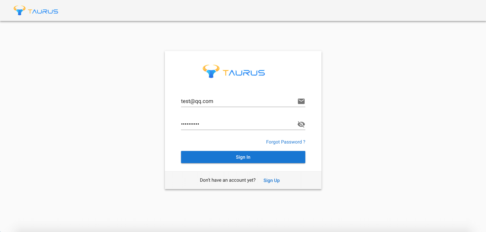

## Overview

- 概要ページは、主に総収入・インプレッション数・ecpm・クリック率・フィルレートなど一定期間におけるアプリのトータルパフォーマンスを表示します。トレンドが見える折れ線グラフの他、日付ごとのデータが見える集計表で表示することもできます。

- 任意の時間帯、或いは特定の種類の折れ線グラフを選択することができます。

- データを確認するために、先にアプリを追加する必要があります。

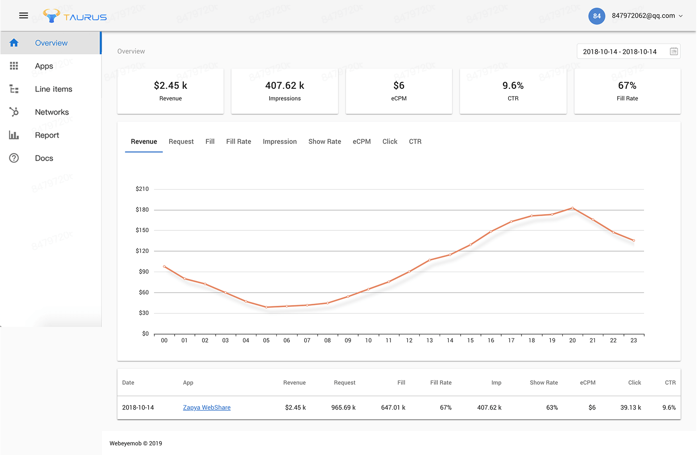

## Apps

アプリページは、アプリと広告枠の管理に使用されます。アプリと広告枠を追加・編集・削除・閲覧することができます。

### App

#### App list

アプリリストページにおいてアプリを追加・編集・削除・閲覧することができ、またアプリ・プラットフォーム・状況に関するデータをフィルターで抽出することができます。
アプリIDは、AdLimeを統合する際に初期化されたパラメーターであり、アプリリストページにて閲覧・コピーすることができます。

::: warning
アプリを削除、或いは無効化した後、それに関連する全ての広告枠は利用できなくなるので、ご注意ください。
:::

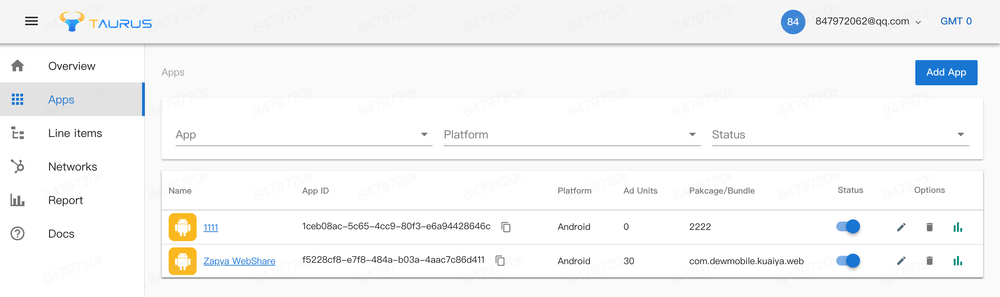

#### Create new apps

右上の「アプリ追加」ボタンをクリックし、手動でアプリを追加します。以下の情報を入力してください。

- `アプリネーム`：アプリを見分けるために、自己定義した特定のタイトルを入力してください。
- `パッケージ名`：Androidアプリのパッケージ名またはIOSアプリのバンドルIDを入力してください。
- `カテゴリー`：広告のターゲティング精度と収益を上げるために、最適なカテゴリーを選択してください。
- `アプリアイコン`：アプリのロゴをアプロードしてください。
セーブ／新規広告枠ボタンをクリックして続けてください。

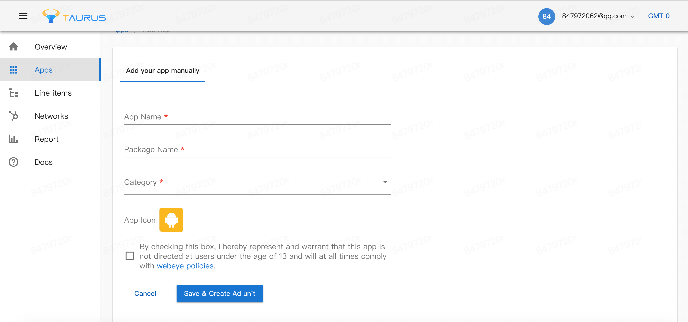

### Ad unit

#### Ad unit list

広告枠リストページにおいて広告枠を追加・編集・削除・閲覧することができ、また広告枠・フォーマット・状況に関するデータをフィルターで抽出することができます。
広告枠IDは、広告をロードする際に使用されたパラメーターであり、広告枠リストページにて検索してコードにコピーすることができます。

::: warning
広告枠を削除、或いは無効化した後、それに関連する全てのラインアイテムは広告を受け取ることができなくなるので、ご注意ください。
::: 

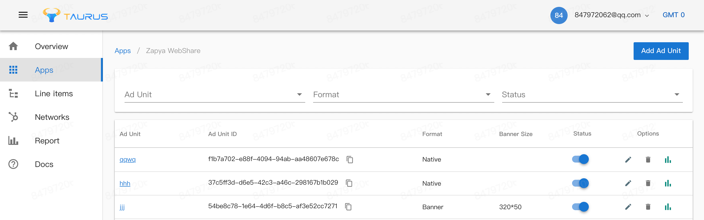

#### Create new AD Unit

右上の「広告枠追加」ボタンをクリックし、手動で広告枠を追加します。以下の情報を入力してください。

`ネーム`：配置を見分けるために、自己定義した特定のタイトルを入力してください。
`フォーマット`：応用場面に従って広告枠の種類を選択してください。この種類は広告のサイズとフォーマットを決定します。
セーブボタンをクリックして続けてください。

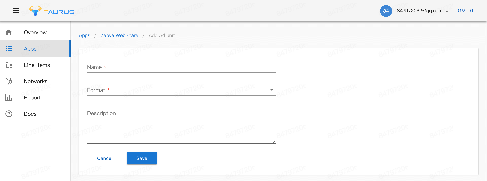

セーブボタンをクリックして続けてください。

### Ad unit - Line Item

#### Ad unit - Line Item

広告枠―ラインアイテムページにおいて広告枠とラインアイテムの相関関係について追加・編集・削除・閲覧することができ、またネットワーク・ラインアイテム名・状況に関するデータをフィルターで抽出することができます。このページにて、収益最大化のためにリクエストの優先度レベルを変更することもできます。

::: warning
ラインアイテムを削除、或いは無効化した後、広告を受け取ることができなくなるので、ご注意ください。
:::

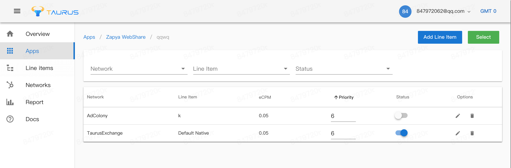

##### Create new Ad Unit – Line Item

右上の「ラインアイテム追加」ボタンをクリックし、手動でラインアイテムを追加します。以下の情報を入力してください。

- `ネーム`：ラインアイテムを見分けるために、自己定義した特定のタイトルを入力してください。
- `フォーマット`：広告プラットフォームにおいて既にリクエストした広告の種類とサイズ。
- `eCPM`：eCPMを記入し、広告の基準価格を決定してください。収益最大化のために、広告をリクエストする際にeCPMと優先度レベルを同時に考慮に入れます。
- `状況`：広告枠―ラインアイテムの開閉操作を行ってください。広告プラットフォームを選択した後、プラットフォームの条件に合うIDを記入する必要があります。

::: tip
ここで追加されたラインアイテムは、広告枠との相関関係を既に持つので、あらためて設定する必要がありません。
:::

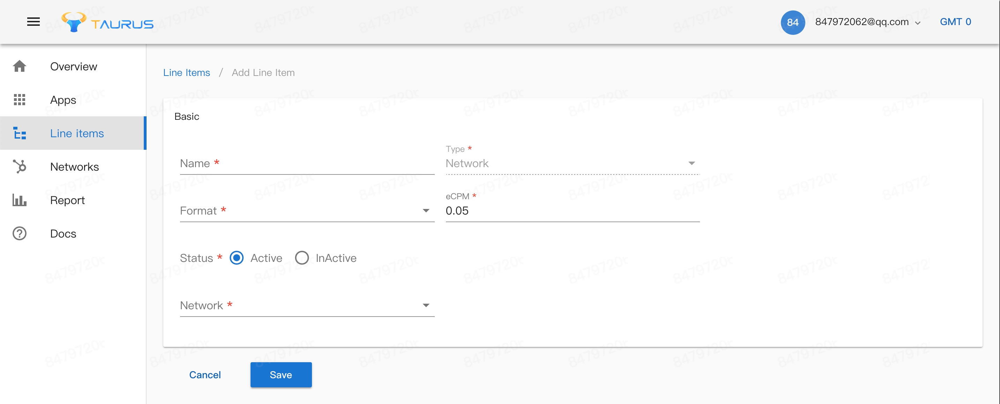

##### 既存のラインアイテムを選んで新な広告ユニットを作成する

右上の”選択”バターで、あなたはbatch新な広告ユニットを既存のラインアイテムと関連することができます。（そうすると、あなたはバッチでリソースを追加できます。）名、ネットワーク、フォマードとecpmでラインアイテムを区別できます。コッピしたいラインアイテムを選んで下記の保存ボタンを選んで変更を完了します。

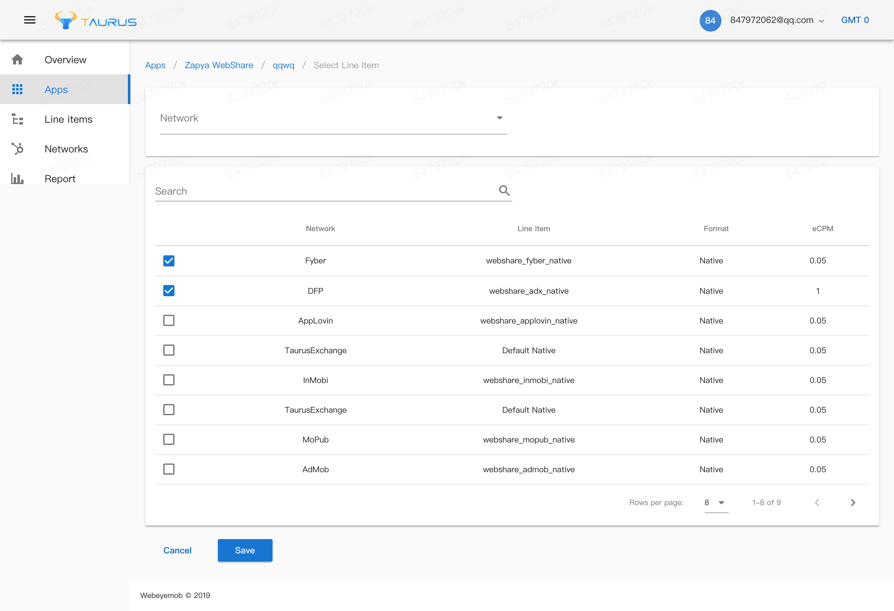

### Networks

ネットワークページにてAdLimeプラットフォームによってサポートされるネットワークを閲覧・アクティブ・無効化することができます。

::: warning
ネットワークを削除、或いは無効化した後、そのネットワークから広告を受け取ることができなくなるので、ご注意ください。
:::

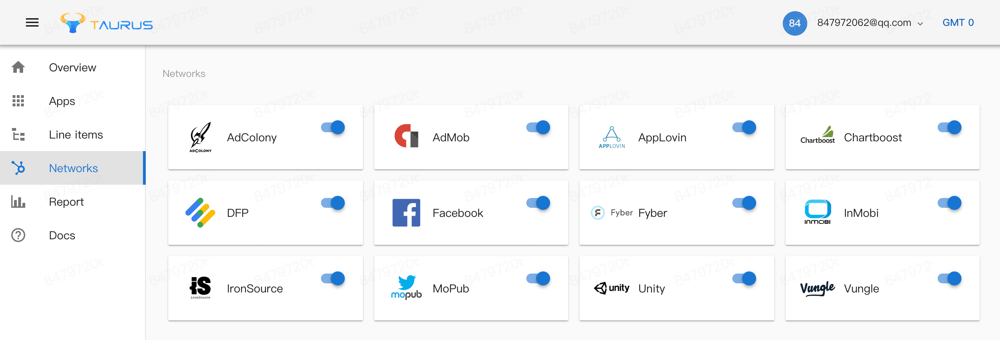

## Report

レポートページにおいて、多次元尺度からパフォーマンスを監視することができます。状況の変化に応じてストラテジーを調整し、収益最大化を図ることに役立ちます。

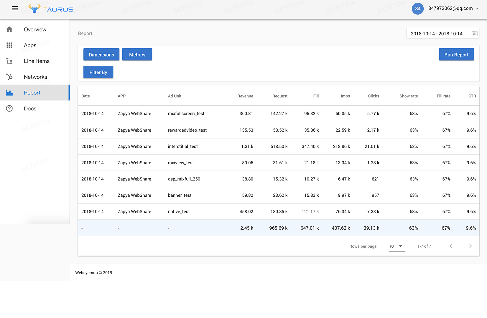
