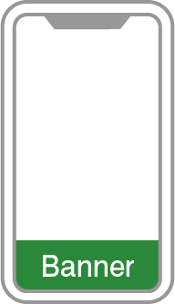
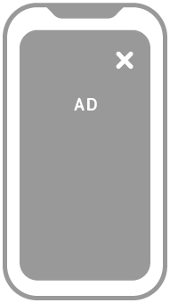
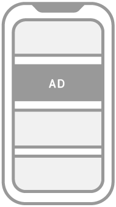

# スタートガイド
このガイドは、AdLime SDK で、Android アプリをマネタイズすることをご希望とする開発者様を対象としています。

アプリに、AdLime SDK を導入することは、広告を表示して収益を獲得するための第一歩です。 SDK を導入したら、広告フォーマット（ネイティブ広告や動画リワード広告など）を選択し、該当する手順に従ってください。

## 前提条件

1. Android Studio 1.0 以上
2. Android API レベル 14 以上
3. AdLime アカウントを作成し、アプリが登録済み

## AdLime SDK を導入する

アプリに AdLime SDK をインストールするには、JFrog の Bintray リポジトリを指す Gradle 依存関係を使用します。このリポジトリを使うには、アプリのプロジェクトレベルの build.gradle ファイルで、このリポジトリを参照する必要があります。ファイルを開き、 allprojects セクションを見つけ、以下を参考にリポジトリを指定します。

### プロジェクトレベルの build.gradle の例（抜粋）

```
allprojects {
    repositories {
        // AdLime
        maven { url "https://dl.bintray.com/adlime/AdLime" }

        google()
        jcenter()
        maven { url "https://maven.google.com/"}
    }
}
```
次に、アプリレベルの build.gradle ファイルを開き、「dependencies」セクションを開きます。

### アプリレベルの build.gradle の例（抜粋）
広告 SDK を導入する方法は、2通りあります。いずれかの方法を選択してください。

#### 方法 ①

###### AdLime SDK を導入
アプリケーションレベルの build.gradle に、下記の依存関係を追加します。
```
dependencies {
    implementation 'com.access_company.adlime:adlime:1.9.18'
}
```
その後、必要に応じてメディエーションを導入します。各メディエーションの導入方法については、ドキュメントの[メディエーション](./Interstitial.md)をご覧ください。

#### 方法 ②
AdMob・Facebook・DFP・ MoPub・TikTok・AppLovin などの6つのメディエーションが含まれた SDK を導入します。各メディエーション SDK が不要となり、導入が簡単になります。

##### AdLime All SDK を導入
アプリケーションレベルの build.gradle に、下記の依存関係を追加します。
```
dependencies {
    implementation 'com.access_company.adlime:adlime_all:1.7.9'
}
```
##### マニフェストファイルへの記述
マニフェストファイル AndroidManifest.xml に必要情報を記述します。
```java
    <provider
        android:name="com.bytedance.sdk.openadsdk.multipro.TTMultiProvider"
        android:authorities="${applicationId}.TTMultiProvider"
        android:exported="false" />
    <meta-data
        android:name="applovin.sdk.key"
        android:value="${applovin_value}" />
```
${applovin_value} は Applovin の SDK key です。今回は下記の値を設定します。 **"qTA2uuo2zUQLXHPGDPooTJLZprJIiR6HDcHEgaJq24ErXVwNTqt73MlOFEssXOL9Q1RIFDlR1136
N8uhTlthKc"**

作業完了後に、Gradle の同期を行います。

## 広告のフォーマットを選択する

これで AdLime SDK の導入が完了し、広告の実装ができるようになりました。 AdLime には、さまざまな広告フォーマットが用意されています。その中からアプリのユーザー エクスペリエンスに最適なフォーマットを選択できます。


### バナー

<div class="clearfix cust-image-text">

バナー広告とは、アプリのレイアウトにおいて特定の位置を占める矩形のイメージまたはテキスト広告です。この種の広告は、ユーザーがアプリを操作している間は画面に広告が残り、一定の時間が経過すると自動的に更新することが特徴です。モバイル広告を初めて掲載する場合は、まずバナー広告から始めることが最適です。
</div>

### インタースティシャル

<div class="clearfix cust-image-text">

インタースティシャル広告とは、ユーザーが広告を閉じるまで、アプリの上にオーバーレイで表示されるフルスクリーン広告です。ゲームのステージが変わる合間や、1つのミッションが完了になった直後など、アプリの画面が切り替わるタイミングで使用するのに適しています。
</div>

### ネイティブ

<div class="clearfix cust-image-text">

ネイティブ広告とは、コンポーネントベースの広告フォーマットで、クリエイティブ（タイトルやキャッチコピーなど）をアプリに表示する方法を、自由にカスタマイズできます。フォント・色・その他クリエイティブの詳細設定を行い、コンテンツの邪魔にならないように広告を表示し、ユーザーエクスペリエンスを向上させることができます。
</div>

### 動画リワード

<div class="clearfix cust-image-text">

動画リワード広告とは、ユーザーが動画を最後まで視聴することと引き換えに、アプリ内で報酬（インセンティブ）を獲得できるフルスクリーン動画広告です。
</div>


