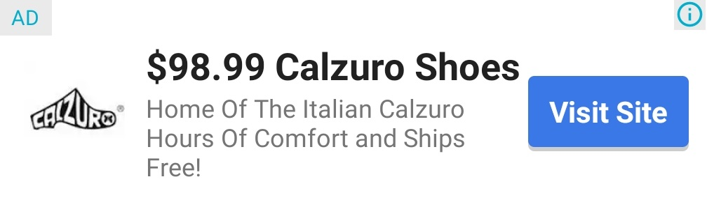
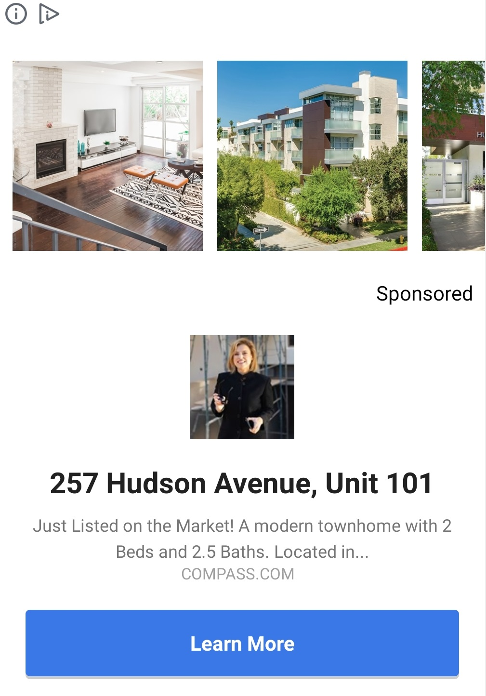

# ネイティブ広告

ネイティブ広告とは、広告のデザインをカスタマイズできるディスプレイ広告です。広告の配置やスタイルをカスタマイズできるため、コンテンツに溶け込んだ広告を表示することができます。広告のコンポーネントを受け取り、デフォルトもしくはカスタムのUIデザインを指定することによって広告を表示することが可能になります。

このガイドでは、ネイティブ広告を iOS アプリに表示する方法と、その過程で考慮すべき重要なポイントについて説明します。

**<u>複合型広告枠を用いることでより効果的に広告収益を高めることができます。詳細は [MixViewAd](./mixviewad.md) をご確認ください。</u>**


## 前提条件
- AdLime SDK が導入済みであること

## ネイティブ広告の作成

ネイティブ広告は、NativeAd クラスによって読み込みされます。まず NativeAd をインスタンス化し、その広告ユニット ID を設定してください。

:::: tabs

::: tab Java

```java
import com.access_company.adlime.core.api.ad.nativead.NativeAd;

public class MainActivity extends AppCompatActivity {
    NativeAd mNativeAd;

    @Override
    protected void onCreate(Bundle savedInstanceState) {
        super.onCreate(savedInstanceState);
        // 広告ユニットID の定義
        String nativeId = "4202d9c4-c08c-4cc9-9810-678a1ae52811";
        // NativeAd を生成
        mNativeAd = new NativeAd(this);
        mNativeAd.setAdUnitId(nativeId);
    }
}

```

:::

::: tab Kotlin

```kotlin
import com.access_company.adlime.core.api.ad.nativead.NativeAd

class MainActivity : AppCompatActivity() {
    lateinit var mNativeAd: NativeAd

    override fun onCreate(savedInstanceState: Bundle?) {
        super.onCreate(savedInstanceState)
        // 広告ユニットID の定義
        val nativeId = "4202d9c4-c08c-4cc9-9810-678a1ae52811"
        // NativeAd を生成
        mNativeAd = NativeAd(this)
        mNativeAd.adUnitId = nativeId
    }
}
```

:::

::::

## 広告レイアウトの作成

NativeAd で広告を受け取った後、各要素に割り当てます。 AdLime SDKでは、ネイティブ広告要素のレイアウトをコーディングによって行うか、 SDK に含まれる各広告フォーマットを使用するか選択することができます。

### NativeAdLayout.Builder

ネイティブ広告の要素は、 NativeAdLayout.Builder によって 広告ページ と ネイティブ広告の要素をバインディングすることができます。

### NativeAdLayout.Builder メソッド一覧

| メソッド               | ビュータイプ | 詳細                                  | 操作                                      |
| -------------------- | --------- | -------------------------------------- | ---------------------------------------------- |
| setLayoutId          | ViewGroup | 親レイアウト                              | M                                              |
| setMediaViewLayoutId | ViewGroup | メディアレイアウト                       | MediaViewLayout もしくは IconLayout どちらか1つ以上 |
| setMediaImageScaleType| ScaleType| メディアの画像スケールタイプ            | O, デフォルトは ScaleType.FIT_CENTER        |
| setIconLayoutId      | ViewGroup | ロゴの URL / アプリのロゴ                    | MediaViewLayout もしくは IconLayout どちらか1つ以上 |
| setIconScaleType     | ScaleType | ロゴのスケールタイプ                      | O, デフォルトは ScaleType.FIT_CENTER        |
| setAdChoicesLayoutId | ViewGroup | 広告選択レイアウト                             | M                                              |
| setTitleId           | TextView  | タイトル                                 | M                                              |
| setCallToActionId    | TextView  | アクションボタン                         | M                                              |
| setAdvertiserId      | TextView  | 広告主 / オフィシャルサイト           | O                                              |
| setSubTitleId        | TextView  | サブタイトル                           | O                                              |
| setBodyId            | TextView  | 本文                                   | O                                              |
| setRatingBarId       | RatingBar | 評価レーティングバー                               | O                                              |
| setRatingTextViewId  | TextView  | アプリストアでの評価レート（例：4.5）                    | O                                              |
| setStoreId           | TextView  | アプリストア（例：Google Play）          | O                                              |
| setPriceId           | TextView  | アプリストアの価格（例：無料）                 | O                                              |  

**<font color="Gray">Facebook を利用する場合には Facebook の広告フォーマットごとにレイアウトで必要な要素が異なることに注意してください。 Facebook のネイティブ広告を利用する場合には MediaView が必須です。また、ネイティブバナー広告を用いる場合には MediaView を除き IconLayout を設定してください。</font>**

### レイアウトをカスタマイズする

NativeAdLayaout メソッドを使用して、各要素の設定を行い、ビューグループをカスタマイズすることが可能です。
以下のコードを参考にしてください。

:::: tabs

::: tab Java

```java
NativeAdLayout layout = NativeAdLayout.Builder()
    .setLayoutId(R.layout.layout_nativead)
    .setAdChoicesLayoutId(R.id.ad_choices)
    .setMediaViewLayoutId(R.id.media)
    .setIconLayoutId(R.id.icon)
    .setTitleId(R.id.title)
    .setBodyId(R.id.body)
    .setCallToActionId(R.id.action_text)
    .build();
mNativeAd.setNativeAdLayout(layout);
```

:::

::: tab Kotlin
```kotlin
val layout = NativeAdLayout.Builder()
    .setLayoutId(R.layout.layout_nativead)
    .setAdChoicesLayoutId(R.id.ad_choices)
    .setMediaViewLayoutId(R.id.media)
    .setIconLayoutId(R.id.icon)
    .setTitleId(R.id.title)
    .setBodyId(R.id.body)
    .setCallToActionId(R.id.action_text)
    .build()
mMixViewAd?.setNativeAdLayout(layout)
```

:::

::::

### AdLime のビルトイン レイアウトを使用する

AdLime のビルトイン レイアウトで 広告を表示することもできます。

:::: tabs

::: tab Java

```java
mNativeAd.setNativeAdLayout(NativeAdLayout.getLargeLayout1());
```

:::

::: tab Kotlin

```kotlin
mNativeAd.setNativeAdLayout(NativeAdLayout.getLargeLayout1())
```

:::

::::

### 切替可能なレイアウトを使用する

AdLime SDK は ケースに応じてレイアウトを変更できるインターフェイスを提供します。以下のコードを参考にしてください。

:::: tabs

::: tab Java

```java
// 方法 1
mNativeAd.setNativeAdLayout(new INativeAdLayoutPolicy() {
    @Override
    public NativeAdLayout getNativeAdLayout(ILineItem lineItem) {
        // lineItem に指定するレイアウトによってカスタマイズが可能
        return null;
    }
});

// 方法 2
// 順番に表示されるレイアウト
mNativeAd.setNativeAdLayout(new SequenceNativeAdLayoutPolicy.Builder()
    .add(layout)
    .add(NativeAdLayout.getMediumLayout())
    .build());
// ランダムに表示されるレイアウト
mNativeAd.setNativeAdLayout(new RandomNativeAdLayoutPolicy.Builder()
    .add(layout)
    .add(NativeAdLayout.getSmallLayout())
    .build());
```

:::

::: tab Kotlin

```kotlin
// 方法 1
mNativeAd?.setNativeAdLayout(object : INativeAdLayoutPolicy {
    override fun getNativeAdLayout(lineItem: ILineItem): NativeAdLayout? {
        // lineItem に指定するレイアウトによってカスタマイズが可能
        return null
    }
})

// 方法 2 追記
```

:::

::::

### 広告インタラクティブエリアを設定する
広告のインタラクティブエリアを設定することにより、ネイティブ広告の各要素のクリック可否が設定できます。設定しない場合は、すべての要素をクリックが可能です。<br>
以下は、 NativeAdLayout オブジェクトの InteractiveArea を設定するサンプルコードです。

:::: tabs

::: tab Java

```
NativeAdLayout layout = NativeAdLayout.Builder()
    ......
    .setInteractiveArea(
        InteractiveArea.Builder()
                .addTitle()
                .addBody()
                .addCallToAction()
                .addIconLayout()
                .addMediaViewLayout()
                .build()
    )
    .build();
```

:::

::: tab Kotlin

```kotlin
//  CODE
```

:::

::::


上記の例では，指定した要素がインタラクティブエリアに含まれます
- タイトル・本文・アクションボタン・メディア・アイコン
.addXxx(Xxxは要素名) をコードに追加することで、インタラクティブエリアに要素を追加することになります。

## レイアウトの読み込み
loadAd() メソッドで広告を読みます。

:::: tabs

::: tab Java

```java
mNativeAd.loadAd();
```

:::

::: tab Kotlin

```kotlin
mNativeAd.loadAd()
```

:::

::::

## 広告イベント

広告の動作をより細かくカスタマイズするには、広告のライフサイクルで発生する様々なイベント（読み込み、開始、終了など）を追加することができ、AdListener クラスを使い、これらのイベントを受け取ることができます。

NativeAd のイベントを取得するには、`SimpleAdListener` インスタンスを作成し、`setAdListener()` で登録します。

:::: tabs

::: tab Java

```java
mNativeAd.setAdListener(new SimpleAdListener() {
    @Override
    public void onAdLoaded() {
        // 広告のロード完了
        Log.d(TAG, "on NativeAd Loaded");
    }

    @Override
    public void onAdFailedToLoad(AdError adError) {
        // 広告の読み込み失敗
        Log.d(TAG, "on NativeAd FailedToLoad err:" + adError.toString());
    }

    @Override
    public void onAdClicked() {
        // 広告をクリック
        Log.d(TAG, "on NativeAd Clicked");
    }

    @Override
    public void onAdShown() {
        // 広告を表示
        Log.d(TAG, "on NativeAd Shown");
    }
});
```

:::

::: tab Kotlin

```kotlin
mNativeAd.adListener = object: SimpleAdListener() {
    override fun onAdLoaded() {
        // 広告のロード完了
        println("on NativeAd Loaded")
    }

    override fun onAdFailedToLoad(adError: AdError?) {
        //  広告の読み込み失敗、エラー詳細は adError から取得
        println("onAdFailedToLoad: " + adError.toString())
    }

    override fun onAdShown() {
        //  広告を表示
        println("on NativeAd Shown")
    }

    override fun onAdClicked() {
        //  広告をクリック
        println("on NativeAd Clicked")
    }
}
```

:::

::::

### 広告のロードエラーについて
広告の読み込に失敗した場合は、AdListener の `onAdFailedToLoad(AdError adError)` が呼び出されます。その際に `adError.getCode()`、 `adError.toString()` から、エラーコード、エラー情報が取得できます。

#### エラーコードとエラーメッセージについて

[エラー情報](./error.md#エラーコードとエラーメッセージ)を確認してください。

## 広告の表示
広告が読み込まれると、適切な場所に表示できます。

:::: tabs

::: tab Java

```java
mNativeAd.setAdListener(new SimpleAdListener() {
    @Override
    public void onAdLoaded() {
        View view = mNativeAd.getAdView();
        if(view != null) {
            mNativeAdContainer.removeAllViews();
            mNativeAdContainer.addView(view);
        }
    }
});

mNativeAd.loadAd();
```

:::

::: tab Kotlin

```kotlin
mNativeAd.adListener = object: SimpleAdListener() {
    override fun onAdLoaded() {
        val view = mNativeAd.getAdView()
        if(view != null) {
            mNativeAdContainer.removeAllViews()
            mNativeAdContainer.addView(view)
        }
    }
}

mNativeAd.loadAd()
```

:::

::::

## ビルトイン ネイティブ広告レイアウト

AdLime SDK には様々な NativeAd レイアウトが用意されています。最適なレイアウトを活用し、開発の効率を上げることができます。

### 一般的な ネイティブ広告レイアウト

- カード小：`NativeAdLayout.getSmallLayout()`

レイアウト：`R.layout.adlime_nativead_small`



- カード中：`NativeAdLayout.getMediumLayout()`

レイアウト：`R.layout.adlime_nativead_medium`


- カード大 1：`NativeAdLayout.getLargeLayout1()`

レイアウト：`R.layout.adlime_nativead_large_1`


- カード大 2：`NativeAdLayout.getLargeLayout2()`

レイアウト：`R.layout.adlime_nativead_large_2`


- カード大 3：`NativeAdLayout.getLargeLayout3()`

レイアウト：`R.layout.adlime_nativead_large_3`



- カード大 4：`NativeAdLayout.getLargeLayout4()`

レイアウト：`R.layout.adlime_nativead_large_4`


#### フルスクリーン ネイティブ広告レイアウト

- スタイル 1：`NativeAdLayout.getFullLayout1()`

レイアウト：R.layout.adlime_nativead_full_1


- スタイル 2：`NativeAdLayout.getFullLayout2()`

レイアウト：R.layout.adlime_nativead_full_2


- スタイル 3：`NativeAdLayout.getFullLayout3()`

レイアウト：R.layout.adlime_nativead_full_3


- スタイル 4：`NativeAdLayout.getFullLayout4()`

レイアウト：R.layout.adlime_nativead_full_4


## プリロードとキャッシュ
事前に広告をロードをして、表示までの待ち時間を極力抑えましょう。<br>
また広告をプリロードする・しないに関わらず、広告をキャッシュすることをおすすめします。広告枠では、各広告ネットワークの広告がロードされますが、広告枠の1つのインスタンスを繰り返し使用することで、高いインプレッションを得られ、不要なリクエストも抑えることができます。これらは、[AdLimeLoader](./adloader.md)で実現が可能です。

## 次のステップ
- 他の広告フォーマットを追加で利用したい場合は[広告フォーマットの選択](./adformat.md)に従い、ご希望の広告フォーマットを選択し、Android アプリに実装しましょう。
- 広告が正しく表示できるか確認したい場合は、[広告表示テスト](./test.md)に従い アプリ ID と各広告ネットワークに対応する広告枠 ID を設定して、広告を表示してみましょう。
