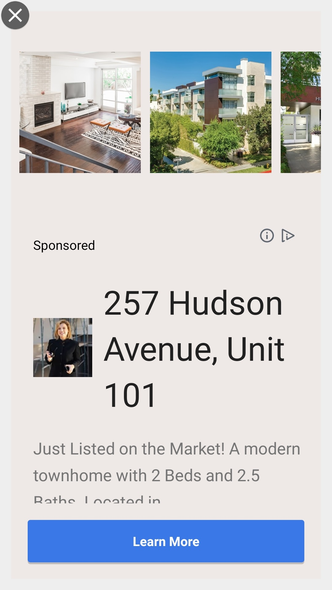

# ネイティブ広告

ネイティブ広告は、プラットフォームに備わっている UI コンポーネントを通じて、ユーザーに表示される広告のクリエイティブです。作成済みのレイアウトに溶け込むように表示され、アプリの視覚デザインに合わせるフォーマットになり、ユーザーエクスペリエンスへの影響を最小限に抑えることができます。コーディングの観点からすれば、ネイティブ広告を読み込む時に広告のクリエイティブを含む NativeAd オブジェクトをアプリが受け取り、（SDKではなく）アプリ自身で広告を表示する仕組みになります。

## 前提条件
- AdLime SDK が導入済みであること

## ネイティブ広告の作成

ネイティブ広告は、NativeAd クラスによって読み込みされます。まず NativeAd をインスタンス化し、その広告ユニット ID を設定してください。

:::: tabs

::: tab Java

```java
// 広告ユニットID の定義
String nativeId = "4202d9c4-c08c-4cc9-9810-678a1ae52811";
// NativeAd を生成
NativeAd mNativeAd = new NativeAd(context);
mNativeAd.setAdUnitId(nativeId);
```

:::

::: tab Kotlin

```kotlin
// 広告ユニットID の定義
val nativeId = "4202d9c4-c08c-4cc9-9810-678a1ae52811"
// NativeAd を生成
val mNativeAd = NativeAd(this)
mNativeAd.setAdUnitId(nativeId)
```

:::

::::

## 広告レイアウトの作成

NativeAd で広告を受け取った後、各要素に割り当てます。 AdLime SDKでは、ネイティブ広告要素のレイアウトをコーディングによって行うか、 SDK に含まれる各広告フォーマットを使用するか選択することができます。

### NativeAdLayout.Builder

ネイティブ広告の要素は、 NativeAdLayout.Builder によって 広告ページ と ネイティブ広告の要素をバインディングすることができます。

### NativeAdLayout.Builder メソッド一覧

| メソッド               | ビュータイプ | 詳細                                  | 操作                                      |
| -------------------- | --------- | -------------------------------------- | ---------------------------------------------- |
| setLayoutId          | ViewGroup | 親レイアウト                              | M                                              |
| setMediaViewLayoutId | ViewGroup | メディアレイアウト                       | MediaViewLayout もしくは IconLayout どちらか1つ以上 |
| setMediaImageScaleType| ScaleType| メディアの画像スケールタイプ            | O, デフォルトは ScaleType.FIT_CENTER        |
| setIconLayoutId      | ViewGroup | ロゴの URL / アプリのロゴ                    | MediaViewLayout もしくは IconLayout どちらか1つ以上 |
| setIconScaleType     | ScaleType | ロゴのスケールタイプ                      | O, デフォルトは ScaleType.FIT_CENTER        |
| setAdChoicesLayoutId | ViewGroup | 広告選択レイアウト                             | M                                              |
| setTitleId           | TextView  | タイトル                                 | M                                              |
| setCallToActionId    | TextView  | アクションボタン                         | M                                              |
| setAdvertiserId      | TextView  | 広告主 / オフィシャルサイト           | O                                              |
| setSubTitleId        | TextView  | サブタイトル                           | O                                              |
| setBodyId            | TextView  | 本文                                   | O                                              |
| setRatingBarId       | RatingBar | 評価レーティングバー                               | O                                              |
| setRatingTextViewId  | TextView  | アプリストアでの評価レート（例：4.5）                    | O                                              |
| setStoreId           | TextView  | アプリストア（例：Google Play）          | O                                              |
| setPriceId           | TextView  | アプリストアの価格（例：無料）                 | O                                              |  
### レイアウトをカストマイズする

NativeAdLayaout メソッドを使用して、各要素の設定を行い、ビューグループをカスタマイズすることが可能です。
以下のコードを参考にしてください。

:::: tabs

::: tab Java

```java
// Sample one：customize
NativeAdLayout layout = new NativeAdLayout.Builder()
    // User customized control ID
    .setLayoutId(R.layout.layout_nativead)
    .setTitleId(R.id.textview_title)
    .build();
mNativeAd.setNativeAdLayout(layout);
```

:::

::: tab Kotlin
```kotlin
//  code
```

:::

::::

### AdLime のビルトイン レイアウトを使用する

AdLime のビルトイン レイアウトで 広告を表示することもできます。

:::: tabs

::: tab Java

```java
mNativeAd.setNativeAdLayout(NativeAdLayout.getLargeLayout1());
```

:::

::: tab Kotlin

```kotlin
mNativeAd.setNativeAdLayout(NativeAdLayout.getLargeLayout1())
```

:::

::::

### 切替可能なレイアウトを使用する

AdLime SDK は ケースに応じてレイアウトを変更できるインターフェイスを提供します。以下のコードを参考にしてください。

:::: tabs

::: tab Java

```java
// 方法 1
mNativeAd.setNativeAdLayout(new INativeAdLayoutPolicy() {
    @Override
    public NativeAdLayout getNativeAdLayout(ILineItem lineItem) {
        // lineItem に指定するレイアウトによってカスタマイズが可能
        return null;
    }
});

// 方法 2
// 順番に表示されるレイアウト
mNativeAd.setNativeAdLayout(new SequenceNativeAdLayoutPolicy.Builder()
    .add(layout)
    .add(NativeAdLayout.getMediumLayout())
    .build());
// ランダムに表示されるレイアウト
mNativeAd.setNativeAdLayout(new RandomNativeAdLayoutPolicy.Builder()
    .add(layout)
    .add(NativeAdLayout.getSmallLayout())
    .build());
```

:::

::: tab Kotlin

```kotlin
// 方法 1
mNativeAd?.setNativeAdLayout(object : INativeAdLayoutPolicy {
    override fun getNativeAdLayout(lineItem: ILineItem): NativeAdLayout? {
        // lineItem に指定するレイアウトによってカスタマイズが可能
        return null
    }
})

// 方法 2 追記
```

:::

::::

### 広告インタラクティブエリアを設定する
広告のインタラクティブエリアを設定することにより、ネイティブ広告の各要素のクリック可否が設定できます。設定しない場合は、すべての要素をクリックが可能です。<br>
以下は、 NativeAdLayout オブジェクトの InteractiveArea を設定するサンプルコードです。

:::: tabs

::: tab Java

```
NativeAdLayout layout = NativeAdLayout.Builder()
    ......
    .setInteractiveArea(
        InteractiveArea.Builder()
                .addTitle()
                .addBody()
                .addCallToAction()
                .addIconLayout()
                .addMediaViewLayout()
                .build()
    )
    .build();
```

:::

::: tab Kotlin

```kotlin
//  CODE
```

:::

::::


上記の例では，指定した要素がインタラクティブエリアに含まれます
- タイトル・本文・アクションボタン・メディア・アイコン
.addXxx(Xxxは要素名) をコードに追加することで、インタラクティブエリアに要素を追加することになります。

## レイアウトの読み込み
loadAd() メソッドで広告を読みます。

:::: tabs

::: tab Java

```java
mNativeAd.loadAd();
```

:::

::: tab Kotlin

```kotlin
mNativeAd.loadAd()
```

:::

::::

## 広告イベント

広告の動作をより細かくカスタマイズするには、広告のライフサイクルで発生する様々なイベント（読み込み、開始、終了など）を追加することができ、AdListener クラスを使い、これらのイベントを受け取ることができます。

NativeAd のイベントを取得するには、`SimpleAdListener` クラスの各デリゲートを定義し、`setAdListener()` で登録します。

:::: tabs

::: tab Java

```java
mNativeAd.setAdListener(new SimpleAdListener() {
    @Override
    public void onAdLoaded() {
        // 広告のロード完了
    }

    @Override
    public void onAdFailedToLoad(AdError adError) {
        // 広告の読み込み失敗
        Log.d(TAG, "on BannerAd FailedToLoad err:" + adError.toString());
    }

    @Override
    public void onAdClicked() {
        // 広告をクリック
        Log.d(TAG, "on BannerAd Clicked");
    }

    @Override
    public void onAdShown() {
        // 広告を表示
        Log.d(TAG, "on BannerAd Shown");
    }

    @Override
    public void onAdClosed() {
        // 広告を閉じる
        Log.d(TAG, "on BannerAd Closed");
    }
});
```

:::

::: tab Kotlin

```kotlin
mNativeAd.setAdListener(object: SimpleAdListener() {
    override fun onAdLoaded() {
        // 広告のロード完了
    }

    override fun onAdFailedToLoad(adError: AdError?) {
        //  広告の読み込み失敗、エラー詳細は adError から取得
        print("onAdFailedToLoad: " + adError.toString())
    }

    override fun onAdShown() {
        //  広告を表示
        print("on NativeAd Shown")
    }

    override fun onAdClicked() {
        //  広告をクリック
        print("on NativeAd Clicked")
    }

    override fun onAdClosed() {
        //  広告を閉じる
        print("on NativeAd Closed")
    }
})
```

:::

::::

### エラー情報
広告の読み込に失敗した場合は、AdListener の `onAdFailedToLoad(AdError adError)` が呼び出されます。その際に `adError.getCode()`、 `adError.toString()` から、エラーコード、エラー情報が取得できます。

 AdError エラーコード一覧
|定義                        |説明     |
|:--------------------------|:--------|
|ERROR_CODE_INTERNAL_ERROR  | 内部エラー |
|ERROR_CODE_INVALID_REQUEST | リクエストが無効 |
|ERROR_CODE_NETWORK_ERROR   | ネットワークエラー |
|ERROR_CODE_NO_FILL         | 配信可能な広告がない   |
|ERROR_CODE_TIMEOUT         | リクエスト　タイムアウト |

エラーには 広告ユニットID(AdUnit)、広告ネットワーク名(Network)、広告のプロパティ(LineItem)が含まれます。
```
ErrorCode is [3], Message is [No Fill]
AdUnit is ...
Network is ...
LineItem is ...
```

## 広告の表示
広告が読み込まれると、適切な場所に表示できます。

:::: tabs

::: tab Java

```java
mNativeAd.setAdListener(new SimpleAdListener() {
    @Override
    public void onAdLoaded() {
        View view = mNativeAd.getAdView();
        if(view != null) {
            mNativeAdContainer.removeAllViews();
            mNativeAdContainer.addView(view);
        }
    }
});

mNativeAd.loadAd();
```

:::

::: tab Kotlin

```kotlin
mNativeAd.setAdListener(object: SimpleAdListener() {
    override fun onAdLoaded() {
        val view = mNativeAd.getAdView()
        if(view != null) {
            mNativeAdContainer.removeAllViews()
            mNativeAdContainer.addView(view)
        }
    }
})
```

:::

::::

## ビルトイン ネイティブ広告レイアウト

AdLime SDK には様々な NativeAd レイアウトが用意されています。最適なレイアウトを活用し、開発の効率を上げることができます。

### 一般的な ネイティブ広告レイアウト

- カード小：`NativeAdLayout.getSmallLayout()`

レイアウト：`R.layout.adlime_nativead_small`


- カード中：`NativeAdLayout.getMediumLayout()`

レイアウト：`R.layout.adlime_nativead_medium`


- カード大 1：`NativeAdLayout.getLargeLayout1()`

レイアウト：`R.layout.adlime_nativead_large_1`


- カード大 2：`NativeAdLayout.getLargeLayout2()`

レイアウト：`R.layout.adlime_nativead_large_2`


- カード大 3：`NativeAdLayout.getLargeLayout3()`

レイアウト：`R.layout.adlime_nativead_large_3`


- カード大 4：`NativeAdLayout.getLargeLayout4()`

レイアウト：`R.layout.adlime_nativead_large_4`


#### フルスクリーン ネイティブ広告レイアウト

- スタイル 1：`NativeAdLayout.getFullLayout1()`

レイアウト：R.layout.adlime_nativead_full_1


- スタイル 2：`NativeAdLayout.getFullLayout2()`

レイアウト：R.layout.adlime_nativead_full_2


- スタイル 3：`NativeAdLayout.getFullLayout3()`

レイアウト：R.layout.adlime_nativead_full_3


- スタイル 4：`NativeAdLayout.getFullLayout4()`

レイアウト：R.layout.adlime_nativead_full_4



## プリロードとキャッシュ
事前に広告をロードをして、表示までの待ち時間を極力抑えましょう。<br>
また広告をプリロードする・しないに関わらず、広告をキャッシュすることをおすすめします。広告枠では、各広告ネットワークの広告がロードされますが、広告枠の1つのインスタンスを繰り返し使用することで、高いインプレッションを得られ、不要なリクエストも抑えることができます。これらは、[AdLimeLoader](./adloader.md)で実現が可能です。