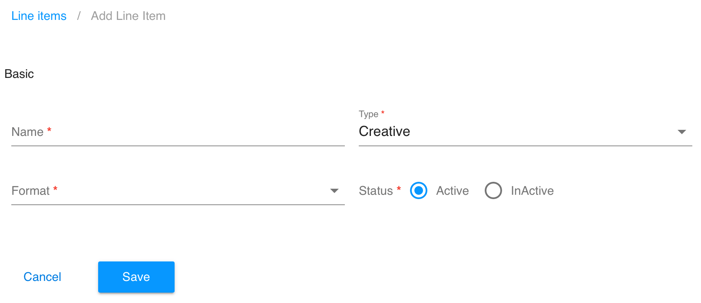
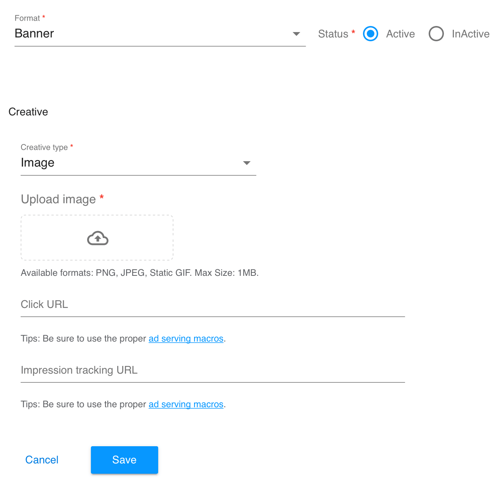
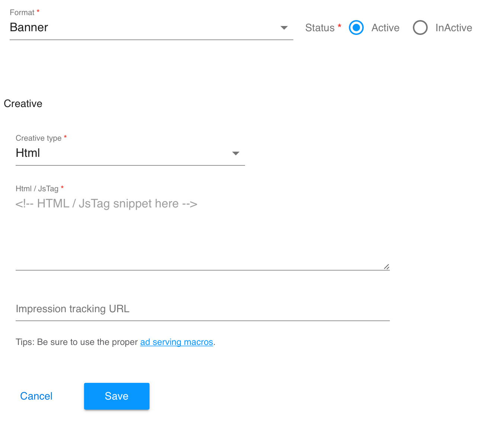
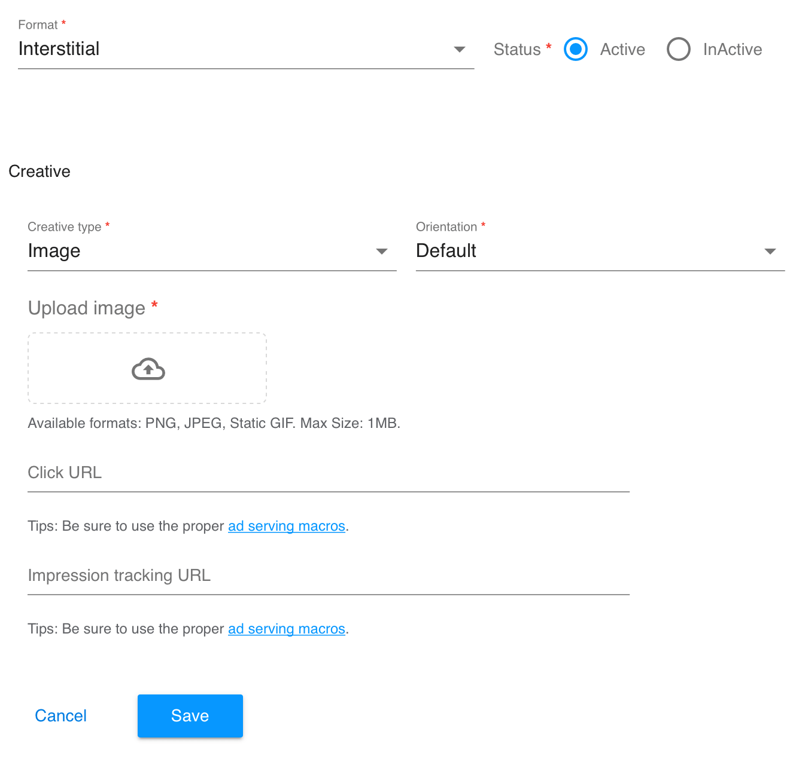
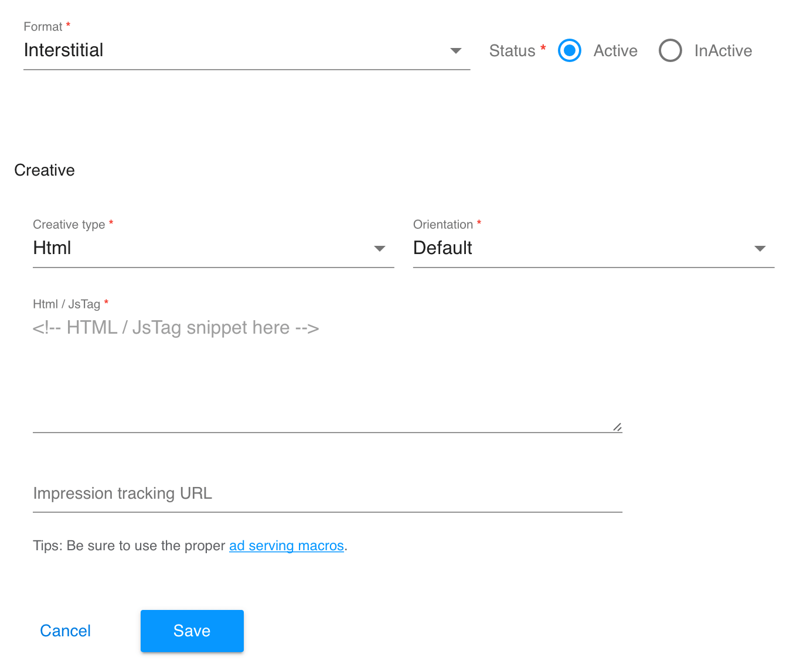
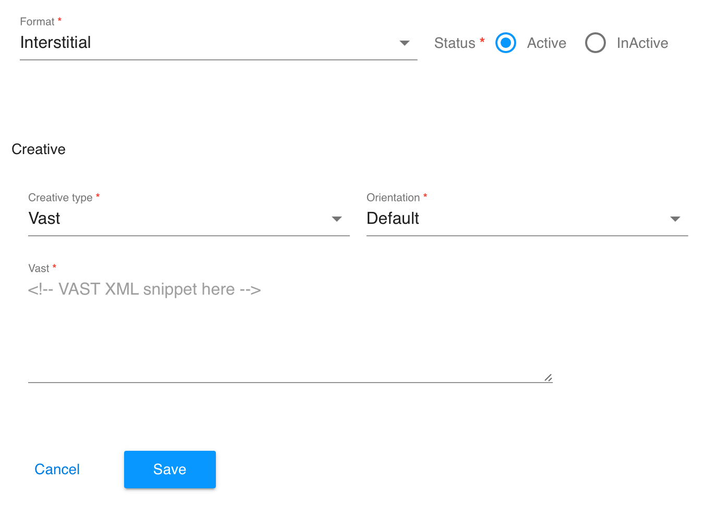
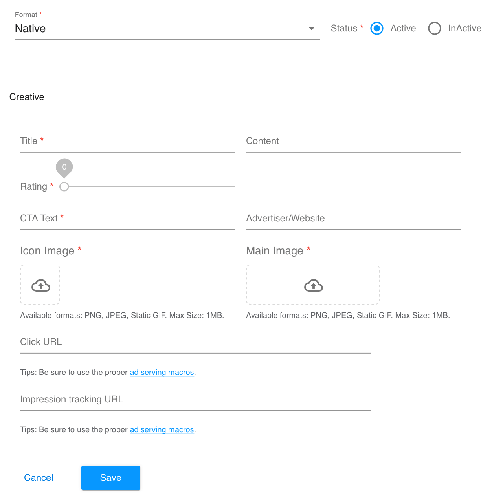
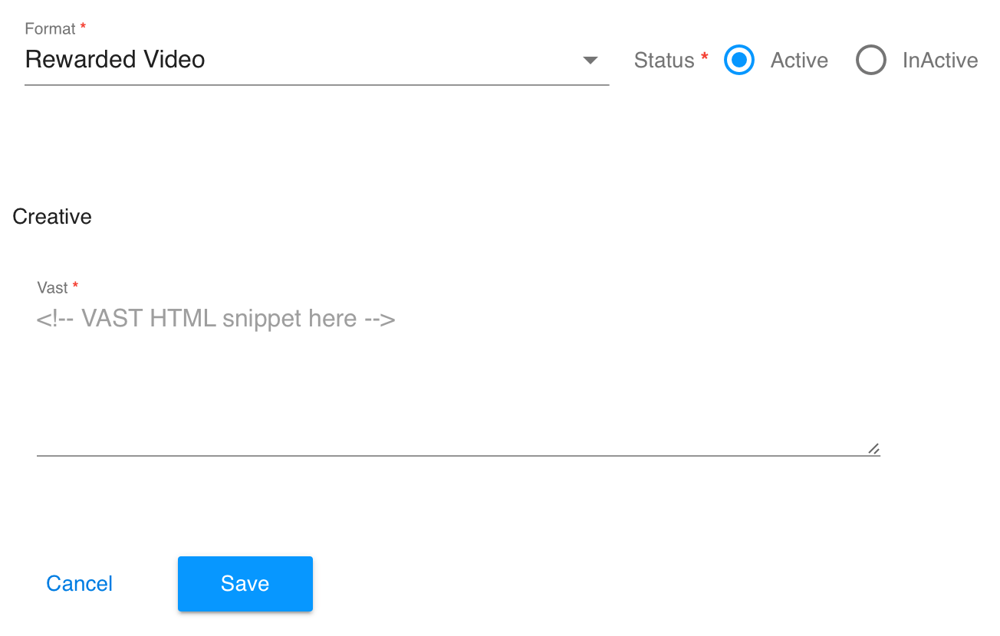

# クリエイティブ広告

## クリエイティブ広告とは？
クリエイティブ広告はバナー、インタースティシャル、ネイティブ、動画リワードという、4つの広告フォーマットをサポートします。自社サービスのプロモーションなどのために、広告コンテンツ(画像や文字)の内容をカスタマイズし、広告として使用することができます。

広告収入に影響しないかたちで、自社サービスのプロモーションをするには、ウォーターフォールの最低レベルに、クリエイティブ広告を追加することをお勧めします。

管理画面で、 lineitem の作成時に、広告タイプが選択でき、クリエイティブ広告を指定できます。


## バナー
バナー では、2つのフォーマットをサポート
- 画像（アップロードされた画像）
- Html（HTML / JsTag）

### 画像（アップロードされた画像）
必要なもの
- Upload image： PNG、JPEG、1MBまでの静的な GIF
- Click URL：広告をクリック後の遷移先 URL リンク
- Impression tracking URL：SDK が広告を表示したときにリクエストを送信する URL リンク



### Html（HTML / JsTag）
必要なもの
- HTML / JsTag：広告の表示やイベント処理
- Impression tracking URL：SDK が広告を表示したときにリクエストを送信する URL リンク



## インタースティシャル
インタースティシャルでは、3つのフォーマットをサポート
- 画像（アップロードされた画像）
- Html（HTML / JsTag）
- Vast（VAST XML）

### 画像（アップロードされた画像）
必要なもの
- Upload image : PNG、JPEG、1MBまでの静的な GIF
- Click URL：広告をクリック後の遷移先 URL リンク
- Impression tracking URL：SDK が広告を表示したときにリクエストを送信する URL リンク



### Html（HTML / JsTag）
必要なもの：
- HTML / JsTag：広告の表示やイベント処理
- Impression tracking URL：SDK が広告を表示したときにリクエストを送信する URL リンク



### Vast（VAST XML）
必要なもの：
- VAST XML：動画URL、クリックURL、インプレッショントラッキング URL などの VAST 規格に準拠



## ネイティブ
必要なもの：
- Title：タイトル ─ アプリやサイト名
- Content：説明 ─ アプリやサイトの詳細
- Rating：アプリストアの評価
- CTA Text：ボタンラベル ─ "インストール" や "詳細" など
- Advertiser/Website：広告主名 および サイト名
- Icon Image：アイコン ─ アプリやウェブサイトのロゴ : PNG、JPEG、1MBまでの静的な GIF
- Main Image：ピクチャ ─ アプリやウェブサイトのプロモーション画像 : PNG、JPEG、1MBまでの静的な GIF
- Click URL：広告をクリック後の遷移先 URL リンク
- Impression tracking URL：SDK が広告を表示したときにリクエストを送信する URL リンク



## 動画リワード
必要なもの：
- VAST XML：動画URL、クリックURL、インプレッショントラッキング URL などの VAST 規格に準拠



## クリエイティブのサンプル

### Html サンプル
```html
<!DOCTYPE html>
<html lang="en">
	<head>
		<meta charset="UTF-8">
		<title>
			Document
		</title>
	</head>
	<style>
		body{margin:0;text-align:center;}
	</style>
	<body>
		<a id="btn" href="https://www.adlime.net">
			
		</a>
	</body>
</html>
```

### Vast サンプル
```xml
<VAST version="3.0">
	<Ad id="1413833">
		<InLine>
			<AdSystem>
				ExoClick
			</AdSystem>
			<AdTitle/>
			<Error>
				<![CDATA[http://your.tracking.server?errorcode=[ERRORCODE]&idzone=2051755]]>
			</Error>
			<Creatives>
				<Creative sequence="1" id="13803673">
					<Linear skipoffset="00:00:15">
						<Duration>
							00:00:59
						</Duration>
						<TrackingEvents>
							<Tracking event="progress" offset="00:00:10.000">
								<![CDATA[http://your.tracking.server?tracking_event=progress&progress=00:00:10.000]]>
							</Tracking>
						</TrackingEvents>
						<VideoClicks>
							<ClickThrough>
								<![CDATA[https://www.adlime.net]]>
							</ClickThrough>
						</VideoClicks>
						<MediaFiles>
							<MediaFile delivery="progressive" type="video/mp4">
								<![CDATA[http://clips.vorwaerts-gmbh.de/big_buck_bunny.mp4]]>
							</MediaFile>
						</MediaFiles>
					</Linear>
				</Creative>
			</Creatives>
		</InLine>
	</Ad>
</VAST>
```