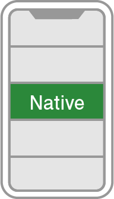

# 広告フォーマット
AdLime は様々な広告フォーマットをサポートしています。アプリのユーザーエクスペリエンスを最大にする広告フォーマットを選択しましょう。

## 基本的な広告フォーマット

### [バナー](./banner.md)

バナー広告とは、アプリのレイアウトにおいて特定の位置を占める矩形のイメージまたはテキスト広告です。バナー広告は、一定時間が経過すると自動的に広告を更新することが特徴の一つです。モバイル広告を初めて掲載する場合は、まずバナー広告から始めてみましょう。

### [インタースティシャル](./Interstitial.md)

インタースティシャル広告とは、アプリ上を覆うように表示されるフルスクリーン広告です。一般的にアプリの画面が切り替わるタイミング（アクティビティが切り替わるタイミングやゲームのステージが変わる合間）で用いられます。

### [ネイティブ](./native.md)

ネイティブ広告とは、広告のデザインをカスタマイズできるディスプレイ広告です。広告の配置やスタイルを自由にカスタマイズできるため、アプリのコンテンツに溶け込んだ広告を表示することができます。

### [動画リワード](./rewarded.md)

動画リワード広告とは、アプリ内で使用可能な報酬をユーザーに付与する代わりに、動画広告を最後までフルスクリーン表示する広告です。

## 複合型広告枠

### [MixViewAd](./mixviewad.md)

MixViewAd とはバナー広告やネイティブ広告などの別種の広告を単一の View で表示ができる機能です。各ネットワークの提供する広告は、個別のフォーマットで独立した広告が提供されていました。この機能を実装することにより、1つの広告枠で表示できる広告の種類と数を増やし、より高い効率で収益を増やすことができます

### [MixFullScreenAd](./mixfullscreenad.md)

MixFullScreenAd はフルスクリーンで表示することができるインタースティシャル広告を拡張した機能です。また、インタースティシャル広告を表示するだけではなく、バナー広告やネイティブ広告なども同じ広告枠にフルスクリーン表示することができます。各ネットワークの提供する広告は、個別のフォーマットで独立した広告が提供されていました。この機能を実装することにより、1つの広告枠で表示できる広告の種類と数を増やし、より高い効率で収益を増やすことができます。

