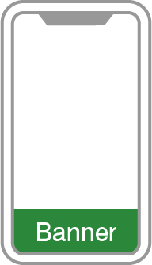
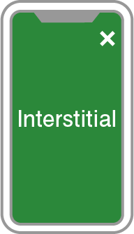

# スタートガイド
このガイドでは AdLime SDK を iOS アプリに組み込むことを目的とした開発者を対象としています。スタートガイドでは AdLime SDK を iOS アプリに組み込むための準備について説明します。SDK 導入後は希望の広告フォーマット（バナー広告、動画リワード広告など）を選択し、該当する手順に従ってください。

## 前提条件
- Xcode 9.2 以上のバージョンを使用
- ターゲットバージョンを iOS 8.0 以上に設定
- AdLime アカウントを作成し、アプリが登録済み

## AdLime SDKを導入する
私達は "AdLimeSdk" と "AdLimeSdk_All" の２種類の SDK を提供しています。これらの SDK の違いは主要なアドネットワークをデフォルトで提供しているかどうかです。

アドネットワークをカスタムに設定することを希望する場合は "AdLimeSdk" を導入することをおすすめします。"AdLimeSdk" を導入後は[メディエーション](./mediation.md)のガイドを参考にしてご希望のアドネットワークを追加してください。 

"AdLimeSdk_All" は AdLimeSdk と AdMob 、DFP、FaceBook、Mopub、AppLovin、TikTok のアドネットワークを標準でサポートしています．これらのアドネットワークの導入を希望する場合はこの SDK を組み込むことも選択肢の一つです。"AdLimeSdk_All" の SDK を導入することで各アドネットワークごとに必要な SDK を追加するなどの手順をいくらかスキップすることが可能です。

### AdLimeSdk
#### CocoaPods（推奨）
iOS プロジェクトに AdLime SDK を導入するための最も簡単な方法は CocoaPods を使用することです。プロジェクトの Podfile を開き、下記のコードをアプリのターゲットに追加してください。
```objectivec
pod 'AdLimeSdk'
```

コマンドラインから次のコマンドを実行してください:
```objectivec
pod install --repo-update
```

CocoaPods を初めてご利用の場合、 CocoaPods の[公式ドキュメント](https://guides.cocoapods.org/using/using-cocoapods)で Podfile の作成方法と使用方法をご確認ください。

#### 手動ダウンロード
SDK フレームワークを直接ダウンロードして解凍し、下記のフレームワークを Xcode プロジェクトに導入してください。

- [AdLimeSdk.framework](https://github.com/Ham-mer/AdLime-iOS-Pub/raw/master/DownloadZip/AdLimeSdk/1.5.8.zip)
- AdLimeSdk.bundle

ドラッグ & ドロップ完了後、Build Phases > Copy Bundle Resources に AdLimeSdk.bundle が含まれていることを確認してください。

#### Carthage
プロジェクトの Cartfile を開き、下記のコードをアプリのターゲットに追加してください。
```objectivec
github "Ham-mer/AdLimeSdk"
```

コマンドラインから次のコマンドを実行してください:
```sh
carthage update
```

### AdLimeSdk-All
#### CocoaPods（推奨）
iOS プロジェクトに AdLime SDK を導入するための、最も簡単な方法は CocoaPods を使用することです。プロジェクトの Podfile を開き、下記のコードをアプリのターゲットに追加してください。
```objectivec
pod 'AdLimeSdk-All'
```

コマンドラインから次のコマンドを実行してください:
```sh
pod install --repo-update
```

#### 手動ダウンロード
SDK フレームワークを直接ダウンロードして解凍し、下記のフレームワークを Xcode プロジェクトに導入してください。

- [AdLimeSdk.framework](https://github.com/Ham-mer/AdLime-iOS-Pub/raw/master/DownloadZip/AdLimeSdk/1.5.8.zip)
- AdLimeSdk.bundle
- [Google-Mobile-Ads-SDK.framework](https://developers.google.cn/admob/ios/download)
- GoogleAppMeasurement.framework
- GoogleUtilities.framework
- nanopb.framework
- [AdLimeMediation_GoogleAds.framework](https://github.com/Ham-mer/AdLime-iOS-Pub/raw/master/DownloadZip/AdLimeMediation_GoogleAds/7.52.0.0.zip)
- [AppLovinSDK.framework](https://dash.applovin.com/docs/sdk/download?type=ios-main)
- [AdLimeMediation_AppLovin.framework](https://github.com/Ham-mer/AdLime-iOS-Pub/raw/master/DownloadZip/AdLimeMediation_AppLovin/6.9.4.0.zip)
- [FBAudienceNetwork.framework](https://github.com/Ham-mer/AdLime-iOS-Pub/raw/master/DownloadZip/Networks/FBAudienceNetwork/FBAudienceNetwork_5.6.0.zip)
- [AdLimeMediation_Facebook.framework](https://github.com/Ham-mer/AdLime-iOS-Pub/raw/master/DownloadZip/AdLimeMediation_Facebook/5.6.0.0.zip)
- [MoPubSDKFramework.framework](https://github.com/mopub/mopub-ios-sdk/releases/download/5.10.0/mopub-framework-5.10.0.zip)
- [AdLimeMediation_MoPub.framework](https://github.com/Ham-mer/AdLime-iOS-Pub/raw/master/DownloadZip/AdLimeMediation_MoPub/5.10.0.1.zip)
- [BUAdSDK.framework](https://github.com/Ham-mer/AdLime-iOS-Pub/raw/master/DownloadZip/Networks/BUAdSDK/BUAdSDK_2.5.1.2.zip)
- BUAdSDK.bundle
- [AdLimeMediation_TikTok.framework](https://github.com/Ham-mer/AdLime-iOS-Pub/raw/master/DownloadZip/AdLimeMediation_TikTok/2.5.1.5.1.zip)

ドラッグ & ドロップ完了後、Build Phases > Copy Bundle Resources に AdLimeSdk.bundle,  BUAdSDK.bundleが含まれていることを確認してください。

##### 他のフレームワークの追加
Xcode 上で、プロジェクトファイルを選択し、任意のターゲットの Build Phases > Link Binary With Libraries に以下の Tiktok フレームワークを追加します。

- AdSupport
- AVFoundation
- CoreGraphics
- CoreMedia
- CoreTelephony
- SafariServices
- StoreKit
- SystemConfiguration
- UIKit
- WebKit
- libz.tbd
- MobileCoreServices
- MediaPlayer
- CoreMotion
- libresolv.9.tbd
- libc++.tbd
- MessageUI
- QuartzCore

##### Info.plist の更新

Info.plist ファイルに、 GADApplicationIdentifier キーと、 AdMob の管理画面で登録したアプリの ID を追加してください。

Info.plist を ソースコードとして開いて編集します。
```objectivec
<key>GADApplicationIdentifier</key>
<string>Your AdMob APP_ID</string>
```
もしくは、Xcodeで直接編集できます。


#### Carthage
SDK フレームワークを直接ダウンロードして解凍し、下記のフレームワークを Xcode プロジェクトに導入してください。
- [Google-Mobile-Ads-SDK.framework](https://developers.google.cn/admob/ios/download)
- GoogleAppMeasurement.framework
- GoogleUtilities.framework
- nanopb.framework
- [AppLovinSDK.framework](https://dash.applovin.com/docs/sdk/download?type=ios-main)
- [FBAudienceNetwork.framework](https://github.com/Ham-mer/AdLime-iOS-Pub/raw/master/DownloadZip/Networks/FBAudienceNetwork/FBAudienceNetwork_5.6.0.zip)
- [MoPubSDKFramework.framework](https://github.com/mopub/mopub-ios-sdk/releases/download/5.9.0/mopub-framework-5.10.0.zip)
- [BUAdSDK.framework](https://github.com/Ham-mer/AdLime-iOS-Pub/raw/master/DownloadZip/Networks/BUAdSDK/BUAdSDK_2.5.1.5.zip)
- BUAdSDK.bundle

ドラッグ & ドロップ完了後、Build Phases > Copy Bundle Resources に AdLimeSdk.bundle,  BUAdSDK.bundleが含まれていることを確認してください。

プロジェクトの Cartfile を開き、下記のコードをアプリのターゲットに追加してください。
```objectivec
github "Ham-mer/AdLime-iOS-Carthage"
```

コマンドラインから次のコマンドを実行してください:
```objectivec
carthage update
```
##### 他のフレームワークの追加
Xcode上で、プロジェクトファイルを選択し、任意のターゲットの Build Phases > Link Binary With Libraries に以下の Tiktok フレームワークを追加します。

- AdSupport
- AVFoundation
- CoreGraphics
- CoreMedia
- CoreTelephony
- SafariServices
- StoreKit
- SystemConfiguration
- UIKit
- WebKit
- libz.tbd
- MobileCoreServices
- MediaPlayer
- CoreMotion
- libresolv.9.tbd
- libc++.tbd
- MessageUI
- QuartzCore

##### Info.plist の更新

Info.plist ファイルに、 GADApplicationIdentifier キーと、 AdMob の管理画面で登録したアプリの ID を追加してください。

Info.plist を ソースコードとして開いて編集します。
```objectivec
<key>GADApplicationIdentifier</key>
<string>Your AdMob APP_ID</string>
```
もしくは、Xcodeで直接編集できます。


## Linker Flags の追加
プロジェクトのBuild Settingsで、以下のように [Other Linker Flags] に -ObjC を追加します。


## App Transport Security
iOS 9 では、App Transport Security（ATS）というプライバシー機能が導入されました。この機能は新しいアプリでデフォルトで有効になり、安全な接続を要求します。

広告が ATS の影響を受けないようにするには、次の作業を行ってください：

NSAllowsArbitraryLoads の例外をアプリの Info.plist ファイルに追加して、ATS による制限を無効にします。


```objectivec
<key>NSAppTransportSecurity</key>
<dict>
    <key>NSAllowsArbitraryLoads</key>
    <true/>
</dict>
```

## 広告フォーマットを選択する
これで AdLime SDK の導入が完了し、広告を配信できるようになりました。AdLime には様々な広告フォーマットが用意されています。その中からアプリのユーザーエクスペリエンスに最適なものを選択できます。

### バナー

<div class="clearfix cust-image-text">

バナー広告とは、アプリのレイアウトにおいて特定の位置を占める矩形のイメージまたはテキスト広告です。バナー広告は、一定時間が経過すると自動的に広告を更新することが特徴の一つです。モバイル広告を初めて掲載する場合は、まずバナー広告から始めてみましょう。
</div>

### インタースティシャル

<div class="clearfix cust-image-text">

インタースティシャル広告とは、アプリ上を覆うように表示されるフルスクリーン広告です。一般的にアプリの画面が切り替わるタイミング（アクティビティが切り替わるタイミングやゲームのステージが変わる合間）で用いられます。
</div>

### ネイティブ

<div class="clearfix cust-image-text">

ネイティブ広告とは、広告のデザインをカスタマイズできるディスプレイ広告です。広告の配置やスタイルを自由にカスタマイズできるため、アプリのコンテンツに溶け込んだ広告を表示することができます。
</div>

### 動画リワード

<div class="clearfix cust-image-text">

動画リワード広告とは、アプリ内で使用可能な報酬をユーザーに付与する代わりに、動画広告を最後までフルスクリーン表示する広告です。
</div>
