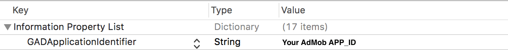

# AdLimeSdk-All の導入方法

AdLime が提供するSDKの AdLimeSdk-All を iOS に導入する方法を説明します。

## CocoaPods（推奨）
iOS プロジェクトに AdLime SDK を導入するための、最も簡単な方法は CocoaPods を使用することです。プロジェクトの Podfile を開き、下記のコードをアプリのターゲットに追加してください。
```objectivec
pod 'AdLimeSdk_All'
```

コマンドラインから次のコマンドを実行してください:
```sh
pod install --repo-update
```

## 手動ダウンロード
SDK フレームワークを直接ダウンロードして解凍し、下記のフレームワークを Xcode プロジェクトに導入してください。

- [AdLimeSdk.framework](https://github.com/Ham-mer/AdLime-iOS-Pub/raw/master/DownloadZip/AdLimeSdk/1.6.6.zip)
- AdLimeSdk.bundle
- [Google-Mobile-Ads-SDK.framework](https://developers.google.cn/admob/ios/download)
- GoogleAppMeasurement.framework
- GoogleUtilities.framework
- nanopb.framework
- [AdLimeMediation_GoogleAds.framework](https://github.com/Ham-mer/AdLime-iOS-Pub/raw/master/DownloadZip/AdLimeMediation_GoogleAds/7.52.0.0.zip)
- [AppLovinSDK.framework](https://dash.applovin.com/docs/sdk/download?type=ios-main)  **（要ログイン）**
- [AdLimeMediation_AppLovin.framework](https://github.com/Ham-mer/AdLime-iOS-Pub/raw/master/DownloadZip/AdLimeMediation_AppLovin/6.9.4.0.zip)
- [FBAudienceNetwork.framework](https://github.com/Ham-mer/AdLime-iOS-Pub/raw/master/DownloadZip/Networks/FBAudienceNetwork/FBAudienceNetwork_5.6.0.zip)
- [AdLimeMediation_Facebook.framework](https://github.com/Ham-mer/AdLime-iOS-Pub/raw/master/DownloadZip/AdLimeMediation_Facebook/5.6.0.0.zip)
- [MoPubSDKFramework.framework](https://github.com/mopub/mopub-ios-sdk/releases/download/5.10.0/mopub-framework-5.10.0.zip)
- [AdLimeMediation_MoPub.framework](https://github.com/Ham-mer/AdLime-iOS-Pub/raw/master/DownloadZip/AdLimeMediation_MoPub/5.10.0.3.zip)
- [BUAdSDK.framework](https://github.com/Ham-mer/AdLime-iOS-Pub/raw/master/DownloadZip/Networks/BUAdSDK/BUAdSDK_2.5.1.5.zip)
- BUAdSDK.bundle
- [AdLimeMediation_TikTok.framework](https://github.com/Ham-mer/AdLime-iOS-Pub/raw/master/DownloadZip/AdLimeMediation_TikTok/2.5.1.5.1.zip)

ドラッグ & ドロップ完了後、Build Phases > Copy Bundle Resources に AdLimeSdk.bundle,  BUAdSDK.bundleが含まれていることを確認してください。

### 他のフレームワークの追加
Xcode 上で、プロジェクトファイルを選択し、任意のターゲットの Build Phases > Link Binary With Libraries に以下の Tiktok フレームワークを追加します。

- AdSupport
- AVFoundation
- CoreGraphics
- CoreMedia
- CoreTelephony
- SafariServices
- StoreKit
- SystemConfiguration
- UIKit
- WebKit
- libz.tbd
- MobileCoreServices
- MediaPlayer
- CoreMotion
- libresolv.9.tbd
- libc++.tbd
- MessageUI
- QuartzCore

### Info.plist の更新

Info.plist ファイルに、 GADApplicationIdentifier キーと、 AdMob の管理画面で登録したアプリの ID を追加してください。

Info.plist を ソースコードとして開いて編集します。
```objectivec
<key>GADApplicationIdentifier</key>
<string>Your AdMob APP_ID</string>
```
もしくは、Xcodeで直接編集できます。


## Carthage
SDK フレームワークを直接ダウンロードして解凍し、下記のフレームワークを Xcode プロジェクトに導入してください。
- [Google-Mobile-Ads-SDK.framework](https://developers.google.cn/admob/ios/download)
- GoogleAppMeasurement.framework
- GoogleUtilities.framework
- nanopb.framework
- [AppLovinSDK.framework](https://dash.applovin.com/docs/sdk/download?type=ios-main)
- [FBAudienceNetwork.framework](https://github.com/Ham-mer/AdLime-iOS-Pub/raw/master/DownloadZip/Networks/FBAudienceNetwork/FBAudienceNetwork_5.6.0.zip)
- [MoPubSDKFramework.framework](https://github.com/mopub/mopub-ios-sdk/releases/download/5.9.0/mopub-framework-5.10.0.zip)
- [BUAdSDK.framework](https://github.com/Ham-mer/AdLime-iOS-Pub/raw/master/DownloadZip/Networks/BUAdSDK/BUAdSDK_2.5.1.5.zip)
- BUAdSDK.bundle

ドラッグ & ドロップ完了後、Build Phases > Copy Bundle Resources に AdLimeSdk.bundle,  BUAdSDK.bundleが含まれていることを確認してください。

プロジェクトの Cartfile を開き、下記のコードをアプリのターゲットに追加してください。
```objectivec
github "Ham-mer/AdLime-iOS-Carthage"
```

コマンドラインから次のコマンドを実行してください:
```objectivec
carthage update
```

Carthage フォルダを確認して、すべてのフレームワークをXcodeプロジェクトに追加してください。ドラッグ & ドロップ完了後、Build Phases > Copy Bundle Resources に AdLimeSdk.bundle が含まれていることを確認してください。
### 他のフレームワークの追加
Xcode上で、プロジェクトファイルを選択し、任意のターゲットの Build Phases > Link Binary With Libraries に以下の Tiktok フレームワークを追加します。

- AdSupport
- AVFoundation
- CoreGraphics
- CoreMedia
- CoreTelephony
- SafariServices
- StoreKit
- SystemConfiguration
- UIKit
- WebKit
- libz.tbd
- MobileCoreServices
- MediaPlayer
- CoreMotion
- libresolv.9.tbd
- libc++.tbd
- MessageUI
- QuartzCore

### Info.plist の更新

Info.plist ファイルに、 GADApplicationIdentifier キーと、 AdMob の管理画面で登録したアプリの ID を追加してください。

Info.plist を ソースコードとして開いて編集します。
```objectivec
<key>GADApplicationIdentifier</key>
<string>Your AdMob APP_ID</string>
```
もしくは、Xcodeで直接編集できます。


## 次のステップ
AdLimeSdk-All を導入したら [AdLimeSdkの導入の続き](./init.md#Linker-Flags-の追加) へ戻り、残りの設定を続けましょう。
