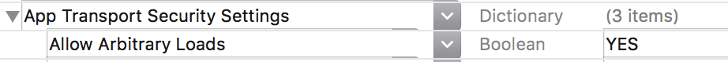

# AdLime SDKの導入
AdLime は "AdLimeSdk" と "AdLimeSdk_All" の２種類の SDK を提供しています。これらの SDK の違いは主要なアドネットワークをデフォルトで提供しているかどうかです。

アドネットワークをカスタムに設定することを希望する場合は "AdLimeSdk" を導入することをおすすめします。"AdLimeSdk" を導入後は[メディエーション](./mediation.md)のガイドを参考にしてご希望のアドネットワークを追加してください。 

"AdLimeSdk_All" は AdLimeSdk と AdMob、DFP、FaceBook、Mopub、AppLovin、TikTok のアドネットワークを標準でサポートしています．これらのアドネットワークの導入を希望する場合はこの SDK を組み込むことも選択肢の一つです。"AdLimeSdk_All" の SDK を導入することで各アドネットワークごとに必要な SDK を追加するなどの手順をいくらかスキップすることが可能です。

## 前提条件
- Xcode 9.2 以上のバージョンを使用
- ターゲットバージョンを iOS 8.0 以上に設定
- AdLime アカウントを作成し、アプリが登録済み

## AdLimeSdk
### CocoaPods（推奨）
iOS プロジェクトに AdLime SDK を導入するための最も簡単な方法は CocoaPods を使用することです。プロジェクトの Podfile を開き、下記のコードをアプリのターゲットに追加してください。
```objectivec
pod 'AdLimeSdk'
```

コマンドラインから次のコマンドを実行してください:
```objectivec
pod install --repo-update
```

CocoaPods を初めてご利用の場合、 CocoaPods の[公式ドキュメント](https://guides.cocoapods.org/using/using-cocoapods)で Podfile の作成方法と使用方法をご確認ください。

### 手動ダウンロード
SDK フレームワークを直接ダウンロードして解凍し、下記のフレームワークを Xcode プロジェクトに導入してください。

- [AdLimeSdk.framework](https://github.com/Ham-mer/AdLime-iOS-Pub/raw/master/DownloadZip/AdLimeSdk/1.6.2.zip)
- AdLimeSdk.bundle

ドラッグ & ドロップ完了後、Build Phases > Copy Bundle Resources に AdLimeSdk.bundle が含まれていることを確認してください。

### Carthage
プロジェクトの Cartfile を開き、下記のコードをアプリのターゲットに追加してください。
```objectivec
github "Ham-mer/AdLimeSdk"
```

コマンドラインから次のコマンドを実行してください:
```sh
carthage update
```

Carthage フォルダを確認して、AdLimeSdk.frameworkとAdLimeSdk.bundleをXcodeプロジェクトに追加してください。ドラッグ & ドロップ完了後、Build Phases > Copy Bundle Resources に AdLimeSdk.bundle が含まれていることを確認してください。

### AdLimeSdk-All
[AdLimeSdk-All の導入方法](./begin_adlimesdk_all.md)を参照してください。

## Linker Flags の追加
プロジェクトのBuild Settingsで、以下のように [Other Linker Flags] に -ObjC を追加します。


## App Transport Security
iOS 9 では、App Transport Security（ATS）というプライバシー機能が導入されました。この機能は新しいアプリでデフォルトで有効になり、安全な接続を要求します。

広告が ATS の影響を受けないようにするには、次の作業を行ってください：

NSAllowsArbitraryLoads の例外をアプリの Info.plist ファイルに追加して、ATS による制限を無効にします。



```objectivec
<key>NSAppTransportSecurity</key>
<dict>
    <key>NSAllowsArbitraryLoads</key>
    <true/>
</dict>
```

## 初期化

広告のロード前に、AdLime の initWithAppId メソッドを呼び出し、 AdLime SDK の初期化を行ってください。この処理はアプリ起動後できるだけ早く実行する必要があり、アプリ起動時に実行することを強く推奨します。またこの処理は1回だけ実行してください。

### テスト環境での実行方法
テスト広告を利用する場合は AdLime の setTestMode を YES に設定してください。また AdLime SDK のデバッグログを確認する場合は AdLime の setLogEnable を YES に設定してください。広告のロードに失敗した場合、広告の詳細なエラーがデバッグログに出力されます。

AdLimeAdErrorCode エラーコード一覧
|定義                           |説明    |
|:-----------------------------|:--------|
|ADLIME_ADERROR_INTERNAL_ERROR  | 内部エラー |
|ADLIME_ADERROR_INVALID_REQUEST | リクエストが無効 |
|ADLIME_ADERROR_NETWORK_ERROR   | ネットワークエラー |
|ADLIME_ADERROR_NO_FILL         | 配信できる広告がない    |
|ADLIME_ADERROR_TIMEOUT         | リクエスト　タイムアウト |

エラーには 広告枠 ID(AdUnit)、広告ネットワーク名(Network)、広告のプロパティ(LineItem)が含まれます。

```
ErrorCode is [3], Message is [No Fill]
AdUnit is ...
Network is ...
LineItem is ...
```

### サンプルコード
AppDelegated の initWithAppId メソッドを呼び出す方法を下記に示します。

:::: tabs

::: tab Objective-C

```objectivec

@import AdLimeSdk;
// Facebookをテスト環境で利用する場合
// @import FBAudienceNetwork;

@implementation AppDelegate

- (BOOL)application:(UIApplication *)application
    didFinishLaunchingWithOptions:(NSDictionary *)launchOptions {

    [AdLime initWithAppId:@"YOUR APP ID"];

    // テスト環境で用いる場合はテストモードに設定してください 
    [AdLime setTestMode: YES];
     // デバッグログを表示する場合は以下を設定してください
    [AdLime setLogEnable: YES];

    // Facebookをテスト環境で利用する場合は以下を設定してください
    // [FBAdSettings addTestDevice: [FBAdSettings testDeviceHash]];

    return YES;
}

@end
```

:::

::: tab Swift

```swift

import AdLimeSdk
// Facebookをテスト環境で利用する場合
// import FBAudienceNetwork

@UIApplicationMain
class AppDelegate: UIResponder, UIApplicationDelegate {

    func application(_ application: UIApplication, didFinishLaunchingWithOptions launchOptions: [UIApplication.LaunchOptionsKey: Any]?) -> Bool {
        ...
        AdLime.initWithAppId("YOUR APP ID")

        // テスト環境で用いる場合はテストモードに設定してください
        AdLime.setTestMode(true)
        // デバッグログを表示する場合は以下を設定してください
        AdLime.setLogEnable(true)

        // Facebookをテスト環境で利用する場合は以下を設定してください
        // FBAdSettings.addTestDevice(FBAdSettings.testDeviceHash())

        return true
    }
    ...

}

```

:::

:::: 


## SDK の例
各広告の実装について、[SDKの例](https://github.com/Ham-mer/AdLime-iOS-Demo)をご覧ください。

## 次へのステップ
- 事前に導入予定のアドネットワークが決定している場合は[メディエーション機能の導入](./mediation.md)を確認し、各アドネットワークごとに必要な SDK の導入手順に従ってください。
- アドネットワークを選択せず、広告を表示したい場合は[広告フォーマットの選択](./adformat.md)に従い、ご希望の広告フォーマットを選択し、iOSアプリに実装しましょう。


