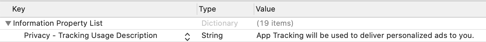

# iOS 14+に備えてください

### IDFAへのアクセスを求めるには、ATT(App Tracking Transparency)権限をリクエストする必要がある
ATTフレームワークがトラッキングパーミッションのダイアログを表示するタイミングや場所について、アプリ開発者はコントロールできます。

ATT権限リクエストを表示するために、Info.plistをアップデートして、NSUserTrackingUsageDescriptionキー、つまり使い道の説明がつくカスタムメッセージを追加してください。下記は説明文テキストのサンプルです。

```objectivec
<key>NSUserTrackingUsageDescription</key>
<string>App Tracking will be used to deliver personalized ads to you.</string>
```



権限リクエストを表示するために、[requestTrackingAuthorizationWithCompletionHandler:](https://developer.apple.com/documentation/apptrackingtransparency/attrackingmanager/3547037-requesttrackingauthorization)を呼び出してください。ユーザーがATTパーミッションを承諾すれば、広告リクエストのプロセスにおいてSDKがIDFAを利用できるので、広告をロードする前に、まず完了のコールバックを待ったほうがおすすめです。

```objectivec
#import <AppTrackingTransparency/AppTrackingTransparency.h>
#import <AdSupport/AdSupport.h>

...

- (void)requestIDFA {
    [ATTrackingManager requestTrackingAuthorizationWithCompletionHandler:^(ATTrackingManagerAuthorizationStatus status) {
        // Tracking authorization completed. Start loading ads here.
        // Note: This is not the main thread!
        // [self loadAd];
    }];
}
```

ステータスバリューに関する詳しい情報は、下記を参照ください 
[ATTrackingManager.AuthorizationStatus](https://developer.apple.com/documentation/apptrackingtransparency/attrackingmanager/authorizationstatus)。

**追記：ユーザーエクスペリエンスが損なわれないように、requestTrackingAuthorizationWithCompletionHandlerがコールされる前に、説明文を追加して、ユーザー向けにパーミッションとデータの使い道について説明したほうが強く勧められます。**

### SKAdNetworkを有効にして、コンバージョンを追跡しましょう
アップルは、コンバージョン追跡用のSKAdNetworkをサポートするので、Network SDKがSKAdNetworkをサポートする場合、IDFAなしでもインストールを追跡できます。

この機能を利用するために、Info.plistにSKAdNetworkItemキーを追加するとともに、各ネットワークにSKAdNetworkIdentifierを追加する必要があります。下記のガイドを参照ください。

- [AdMob](./mediation_admob.md)
- [Google Ad Manager](./mediation_dfp.md)
- [Five(Beta)](./mediation_five.md)

初めは熟考を重ねてから行動してください。新しいSKAdNetworkIdentifierを追加するには、アプリストアのレビューが必要とするからです。

**AdLime は、他のネットワークを可能な限り早くアップデートします。本ページに載せたアップデート情報を時々チェックして、今しばらくお待ちいただけますと幸いです。**