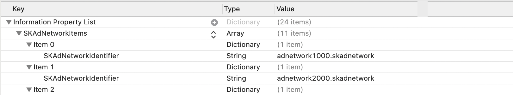

# iOS 14 への準備

## IDFユーザーの追跡やデバイスの広告識別子( IDFA )の取得許可ダイアログ

iOS 14 以降から [App Tracking Transparency (ATT)](https://developer.apple.com/documentation/apptrackingtransparency) フレームワークから、ユーザーの追跡やデバイスの広告識別子( IDFA )の取得にユーザーの許可が必要となりました。広告識別子 によるユーザーの追跡ができない場合、広告収益の大幅な減少が予想されます。
ここでは、ATT フレームワークを使ってユーザーにデバイスの広告識別子の取得許可を要求するダイアログの表示方法を説明します。

まず、Info.plist を編集し、NSUserTrackingUsageDescription を追加してください。これはユーザーを追跡する理由を説明するダイアログ上に表示されるメッセージになります。その文字列を値として記述します。

```objectivec
<key>NSUserTrackingUsageDescription</key>
<string>App Tracking will be used to deliver personalized ads to you.</string>
```


次にユーザーにトラッキングの許可を求めるダイアログを表示します。このダイアログは [requestTrackingAuthorizationWithCompletionHandler:](https://developer.apple.com/documentation/apptrackingtransparency/attrackingmanager/3547037-requesttrackingauthorizationwith) を用いて表示することができます。

:::: tabs

::: tab Objective-C

```objectivec
#import <AppTrackingTransparency/AppTrackingTransparency.h>
#import <AdSupport/AdSupport.h>
...
if (@available(iOS 14.0, *)) {
    [ATTrackingManager requestTrackingAuthorizationWithCompletionHandler:
        ^(ATTrackingManagerAuthorizationStatus status) {
        // ダイアログが閉じた後の挙動
    }];
}
```

:::

::: tab Swift

```swift
import AdSupport
import AppTrackingTransparency
...
// 許可状況を取得
if #available(iOS 14.0, *) {
    ATTrackingManager.requestTrackingAuthorization{ (status) in
        // ダイアログが閉じた後の挙動
    }
}
```

:::

::::

このダイアログを表示するタイミングはアプリ開発者がコントロールすることができます。**このダイアログはアプリのインストール後、1 度のみしか表示されません。一度拒否された場合、OS の設定からのみ変更可能です。そのため、コールするタイミングやユーザーに表示する説明文を熟慮することを強く推奨します。**


## SKAdNetwork を有効化

デバイスの広告識別子の取得の代替案として、Apple は SKAdNetwork の提供をしています。SKAdNetwork は広告を見たユーザーのコンバージョンを計測する機能です。**SKAdNetwork を設定することで、単価の高い広告が表示される可能性があります。**

SKAdNetwork はトラッキングを許可する広告ネットワーク事業者を Info.plist に記述する必要があります。Info.plit に `SKAdNetworkItems` を追加し、各広告ネットワークに対応する `SKAdNetworkIdentifier` を追加します。




各広告ネットワークに対応する Info.plist の設定は以下を確認してください。

- [AdMob](./mediation_admob.md#skadnetwork-の準備ios-14-以上)
- [Google Ad Manager](./mediation_dfp.md#skadnetwork-の準備ios-14-以上)
- [Five (β 版)](./mediation_five.md#ios-14-beta-sdk20200824infoplist-の更新)

**メディエーション対象の広告ネットワークへの iOS 14対応をできる限り早急に行う予定です。**