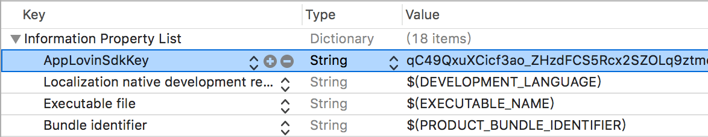
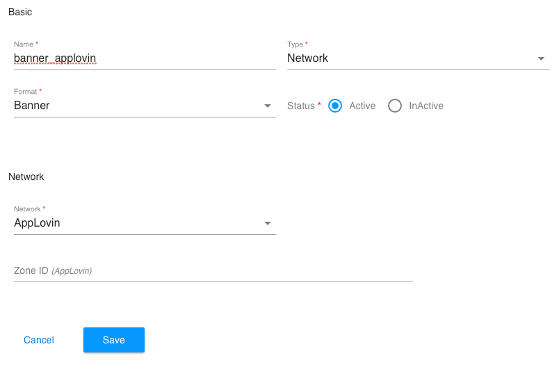

# AppLovin
- [AppLovin Webサイト](https://dash.applovin.com/)
- [AppLovin 開発ガイド](https://dash.applovin.com/docs/integration#iosIntegration)

## 前提条件
- ターゲットバージョン iOS 9.0 以上

## SDKの導入
AdLime SDK で Applovin 広告ネットワークを使用するために、AppLovin SDK と AdLime Adapter SDKを導入してください。

### CocoaPods（推奨）
CocoaPods を使用すると導入が簡単です。プロジェクトの Podfile を開き、下記のコードをアプリのターゲットに追加してください。
```objectivec
pod 'AdLimeMediation_AppLovin'
```

コマンドラインから、以下を実行してください。
```objectivec
pod install --repo-update
```

### 手動ダウンロード
SDK を 直接ダウンロードして解凍し、フレームワークを Xcode プロジェクトにインポートしてください。
- [AppLovinSDK.framework](https://dash.applovin.com/docs/sdk/download?type=ios-main)
- [AdLimeMediation_AppLovin.framework](https://github.com/Ham-mer/AdLime-iOS-Pub/raw/master/DownloadZip/AdLimeMediation_AppLovin/6.9.4.0.zip)

### Carthage
SDK を 直接ダウンロードして解凍し、フレームワークを Xcode プロジェクトにインポートしてください。
- [AppLovinSDK.framework](https://dash.applovin.com/docs/sdk/download?type=ios-main)

プロジェクトの Cartfile を開き、下記のコードをアプリのターゲットに追加してください。
```objectivec
github "Ham-mer/AdLimeMediation_AppLovin"
```

コマンドラインから、以下を実行してください。
```objectivec
carthage update
```

完了後、Carthage フォルダの AdLimeMediation_AppLovin > AdLimeMediation_AppLovin.framework をプロジェクトにインポートします。

## その他のフレームワークの追加
Xcode上で、プロジェクトファイルを選択し、任意のターゲットの Build Phases > Link Binary With Libraries に以下の AppLovin フレームワークを追加します。

- AdSupport
- AVFoundation
- CoreGraphics
- CoreMedia
- CoreTelephony
- SafariServices
- StoreKit
- SystemConfiguration
- UIKit
- WebKit
- libz.tbd

##  Info.plist の更新
Info.plist ファイルに、 AppLovinSdkKey キーと、 AppLovin SDK Key を追加します。 [AppLovin 管理画面](https://dash.applovin.com/docs/integration#iosIntegration)で SDK Key は取得できます。

Info.plist を ソースコードとして開いて編集します。
```objectivec
<key>AppLovinSdkKey</key>
<string>Your AppLovin SDK Key</string>
```

もしくは、プロパティリストエディタ で編集できます。



## サポートできる広告フォーマット

### 広告フォーマット
|ネットワーク |バナー |インタースティシャル |動画リワード |ネイティブ |
|:--------:|:----:|:---------------:|:--------:|:-------:|
|AppLovin  |Y     | Y               | Y        |Y        |

### バナーサイズ
|ネットワーク |320 × 50  |300 × 250   |320 × 100  |468 × 60  |728 × 90  |スマート    |
|:--------:|:------:|:--------:|:-------:|:------:|:------:|:-------:|
|AppLovin  |Y       |Y         |         |        |        |         |

## 広告枠の設置
AdLime を使って Applovin の広告枠を設置する前に、Applovin の管理画面上で広告枠を作成し、その広告枠の情報が必要になります。
- Zone ID&emsp;&emsp;**※Zone ID はオプションです**

AdLime の管理画面を開き、左側の「ネットワーク」メニューをクリックして、 Applovin を有効にしてください。

最後に、左側の「アプリ」メニューをクリックし、 Applovin 広告を表示する広告枠で、「広告のソース追加」をクリックし、 Applovin 広告を追加してください。



## バージョン情報

### リリースバージョン
| AppLovin バージョン | アダプタ バージョン |
|:------------------|:-----------------|
| 6.9.4             | 6.9.4.0          |
| 6.8.0             | 6.8.0.1          |

### バージョン履歴
| バージョン | 日付       | 更新内容                              |
|----------|-----------|----------------------------------|
| 6.9.4.0  | 2019-10-10| AppLovin SDK 6.9.4 に対応|
| 6.8.0.1  | 2019-8-6  | NativeAdLayout インタラクティブエリアのカスタマイズに対応|
| 6.8.0.0  | 2019-6-30 | AppLovin SDK 6.8.0 に対応|
