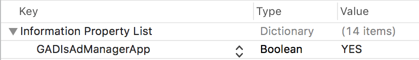

# DFP ドキュメント
- [DFP Webサイト](https://developers.google.com/ad-manager/)
- [DFP 開発者ガイド](https://developers.google.com/ad-manager/mobile-ads-sdk/ios/quick-start)

## 前提条件
- ターゲットバージョン iOS 8.0 以上

## SDKの導入
AdLime SDK で DFP を使用するために、 DFP SDK と、それに対応した AdLime SDKを導入してください。

### CocoaPods

CocoaPods を使用すると導入が簡単です。プロジェクトの Podfile を開き、下記のコードをアプリのターゲットに追加してください。
```objectivec
pod 'AdLimeMediation_GoogleAds'
```

コマンドラインから、以下を実行してください。
```objectivec
pod install --repo-update
```

### 手動でダウンロード
SDK を 直接ダウンロードして解凍し、フレームワークを Xcode プロジェクトにインポートしてください。
- [Google-Mobile-Ads-SDK.framework](https://developers.google.com/ad-manager/mobile-ads-sdk/ios/download)
- GoogleAppMeasurement.framework
- GoogleUtilities.framework
- nanopb.framework
- [AdLimeMediation_GoogleAds.framework](https://github.com/Ham-mer/AdLime-iOS-Pub/raw/master/DownloadZip/AdLimeMediation_GoogleAds/7.55.0.1.zip)

### Carthage
SDK を 直接ダウンロードして解凍し、フレームワークを Xcode プロジェクトにインポートしてください。
- [Google-Mobile-Ads-SDK.framework](https://developers.google.cn/admob/ios/download)
- GoogleAppMeasurement.framework
- GoogleUtilities.framework
- nanopb.framework

プロジェクトの Cartfile を開き、下記のコードをアプリのターゲットに追加してください。
```objectivec
github "Ham-mer/AdLimeMediation_GoogleAds"
```

コマンドラインから、以下を実行してください。
```objectivec
carthage update
```

実行が完了したら、CarthageフォルダーのAdLimeMediation_GoogleAdsにあるAdLimeMediation_GoogleAds.frameworkをプロジェクトにインポートします。

## Info.plist の更新

Info.plist ファイルに、 GADApplicationIdentifier キーを追加してください。この設定により、 Ad Manager アプリであることが明示されます。

Info.plist を ソースコードとして開いて編集します。
```objectivec
<key>GADIsAdManagerApp</key>
<true/>
```

もしくは、プロパティリストエディタ で編集できます。



**Google Mobile Ads SDK 7.42.0 以降のバージョンにおいて、上記を追加する必要があります。 Info.plist ファイルに GADApplicationIdentifier キーがない場合、アプリがクラッシュする可能性があります。その際、下記のメッセージが表示されます："The Google Mobile Ads SDK was initialized incorrectly."**

## NetworkConfig 設置
DFPをカスタマイズで設置します。[DFP NetworkConfig](./mediation/config/networkconfig_dfp.md) を参考してください。

## 利用可能なフォーマット

### 広告タイプ
|ネットワーク|バナー |インタースティシャル |動画リワード |ネイティブ  |
|:-----:|:----:|:----------:|:------:|:----:|
|DFP  |◯     | ◯          |◯       |◯     |

### バナーサイズ
|ネットワーク  |320 × 50  |300 × 250   |320 × 100  |468 × 60  |728 × 90  |SMART    |
|:-------:|:------:|:--------:|:-------:|:------:|:------:|:-------:|
|DFP    |◯       |◯         |◯        |◯       |◯       |◯        |

## テスト広告の表示
SDK を導入し、広告を実装したら広告が正しく表示されるかテストしましょう。[広告表示テスト](./test.md#DFP) の App ID と広告枠 ID を設定して広告が正しく表示されるか確認してください。

## 広告枠の配置
AdLimeのページにてDFPの広告枠を配置するためには、まずDFPのページにおいて広告枠を作成して、下記の情報を獲得する必要があります：  
- App ID  
- AdUnit ID
　
AdLime の管理画面を開き、左側の「ネットワーク」メニューをクリックして、DFP を有効にしてください。

最後に、左側の「アプリ」メニューをクリックし、 DFP 広告を表示する広告枠で、「広告のソース追加」をクリックし、DFP 広告を追加してください。

## バージョン情報

### リリースバージョン
| DFP バージョン     | アダプタ バージョン |
|:-----------------|:-----------------|
|7.56.0            |7.56.0.1         |
|7.55.0            |7.55.0.1         |
|7.52.0            |7.52.0.2         |
|7.50.0            |7.50.0.0         |
|7.42.2            |7.42.2.6         |

### バージョン履歴
| バージョン        | 日付       | 更新内容                              |
|-----------------|------------|----------------------------------|
|7.56.0.1         |2020/3/4    |バナー広告はAdaptive Bannerをサポートします。[AdLimeDFPBannerConfig](./mediation/config/networkconfig_dfp.md) で広告のサイズを設定できます。[Adaptive Banner 紹介](https://developers.google.com/ad-manager/mobile-ads-sdk/ios/banner/adaptive)で確認をお願いします|
|7.55.0.1         |2020/2/14   |- AdMob SDK 7.55.0 に対応<br>- 新たな動画リワードAPIでパラレロードをサポートします |
|7.52.0.2         |2020/2/3    |画面が縦から横になると、広告のサイズは自動調整できない問題を解決します  |
|7.52.0.0         |2019/11/7   |DFP SDK 7.52.0 に対応         |
|7.50.0.0         |2019/10/10  |DFP SDK 7.50.0 に対応         |
|7.42.2.6         |2019/8/4    |NativeAdLayout インタラクティブエリアのカスタマイズに対応|
|7.42.2.1         |2019/7/4    |広告イベントの最適化                |
|7.42.2.0         |2019/6/30   |DFP SDK 7.42.2 に対応         |
