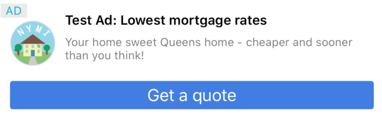
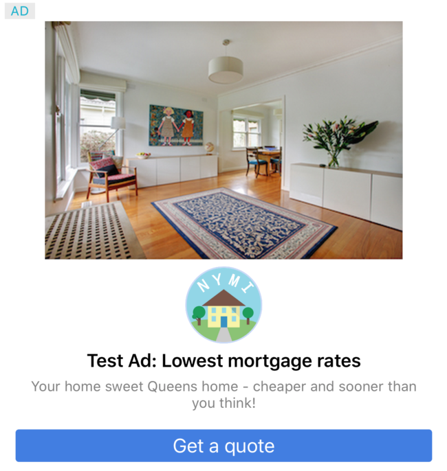
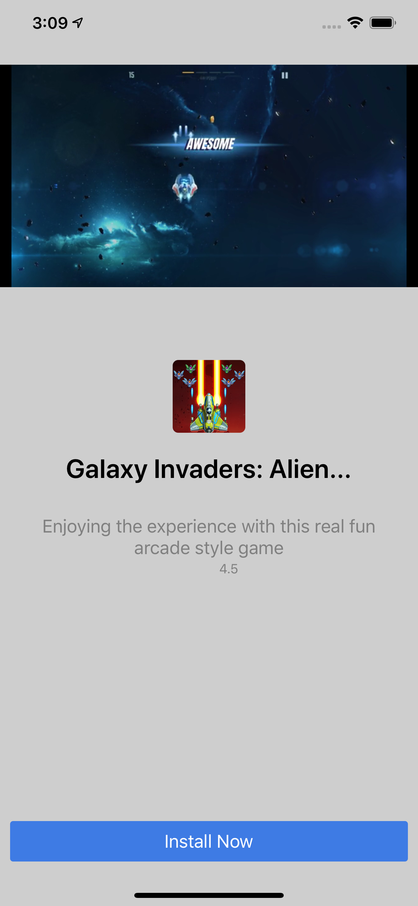
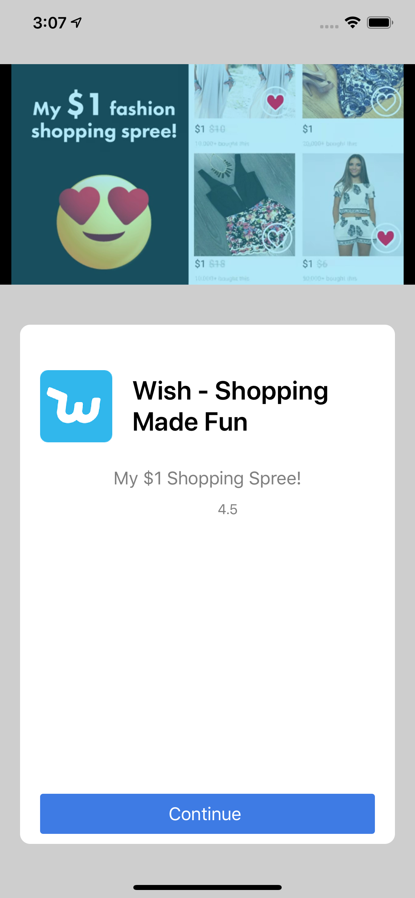
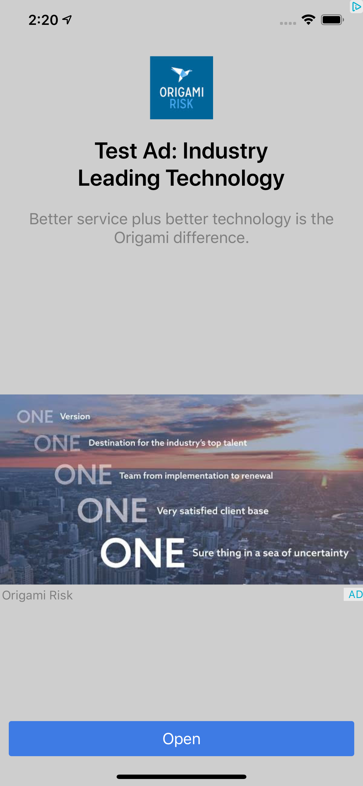
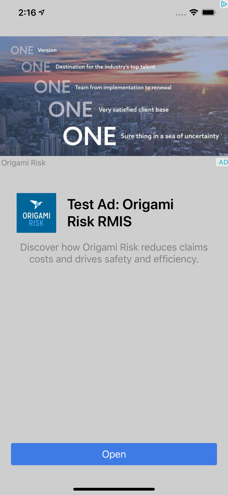

# ネイティブ広告
ネイティブ広告とは、広告のデザインをカスタマイズできるディスプレイ広告です。広告の配置やスタイルをカスタマイズできるため、コンテンツに溶け込んだ広告を表示することができます。広告のコンポーネントを受け取り、デフォルトもしくはカスタムのUIデザインを指定することによって広告を表示することが可能になります。

このガイドでは、ネイティブ広告を iOS アプリに表示する方法と、その過程で考慮すべき重要なポイントについて説明します。

## 前提条件
- AdLime SDK が導入済みであること

## ネイティブ広告の作成
広告を表示するまでのサイクルは `AdLimeNativeAd` オブジェクトを用いて広告をリクエストし、その後広告を表示するためのViewを取得することです。広告を表示するための最初のステップとして AdUnit ID を設定した `AdLimeNativeAd` を生成します。

:::: tabs

::: tab Objective-C

```objectivec
@import AdLimeSdk;
@import UIKit;

@interface ViewController ()

@property(nonatomic, strong) AdLimeNativeAd *nativeAd;

@end

@implementation ViewController

- (void)viewDidLoad {
    [super viewDidLoad];

    nativeAd = [[AdLimeNativeAd alloc] initWithAdUnitId:@"AdUnit_ID"];
}

@end
```

:::

::: tab Swift

```swift
import AdLimeSdk
import UIKit

class ViewController: UIViewController {
    var nativeAd: AdLimeNativeAd!

    override func viewDidLoad() {
        super.viewDidLoad()
        self.nativeAd = AdLimeNativeAd.init(adUnitId: "AdUnit_ID")
    }
}
```

:::

::::


## 広告レイアウトの作成
ネイティブ広告のデザインのカスタマイズやレイアウトは、コーディングによって行います。 AdLime SDK の `AdLimeNativeAdLayout` を使用し、レイアウトを組み込む方法を説明します。
以下の表のように、 `AdLimeNativeAdLayout` は ネイティブ広告のための各 UIView が内包されています。

### `AdLimeNativeAdLayout` 要素一覧
| 要素               | タイプ     | 説明                           | 必須                         |
| ----------------- | --------- | ------------------------------ | --------------------------- |
| `rootView`          | `UIView`    | ルートビュー                     | 必須                         |
| `titleLabel`        | `UILabel`   | タイトル                        | 必須                          |
| `subTitleLabel`     | `UILabel`   | サブタイトル                     | 非必須                        |
| `bodyLabel`         | `UILabel`   | 本文                            | 非必須                       |
| `advertiserLabel`   | `UILabel`   | 広告主                          | 非必須                        |
| `callToActionView`  | `UILabel`   | アクションボタン                       | 必須                         |
| `mediaView`         | `UIView`    | 画像 / 動画                       | `mediaView` もしくは `iconView` どちらか1つ以上 |
| `iconView`          | `UIView`    | サイト/アプリのロゴ            | `mediaView` もしくは `iconView` どちらか1つ以上 |
| `adChoicesView`     | `UIView`    | 広告選択ビュー                        | 必須                          |
| `ratingLabel`       | `UILabel`   | アプリストアでの評価レート（例：4.5）   |非必須                         |
| `priceLabel`        | `UILabel`   | アプリストアの価格 （例：無料）    | 非必須                         |
| `storeLabel`        | `UILabel`   | アプリストアラベル                     | 非必須                         |
| `ratingCallback`    | `callback`  | 評価レートのカスタムコールバック     |非必須                         |

`ratingCallback` は、アプリストアでのアプリ評価レビューのカスタマイズを行えます。

```objectivec
typedef void (^ratingCallback)(double rating);
```

### カスタムレイアウトを生成する 

#### レイアウト作成のためのカスタム View の生成
 レイアウトを作成する最初のステップとして、 `UIView` を生成します。

- Interface Builder で、任意の xib ファイル に UIView の追加を行う
- もしくは、UIView のサブクラスをカスタマイズし生成する


:::: tabs

::: tab Objective-C

// xib ファイル の場合
```objectivec
- (void)viewDidLoad {
    [super viewDidLoad];
    ...

    NSArray *nibViewArray = [[NSBundle mainBundle] loadNibNamed:@"XibNativeAdView" owner:nil options:nil];
    XibNativeAdView *nativeAdView = nibViewArray.firstObject;
}
```

// UIView のサブクラスをカスタマイズで生成する場合
```objectivec
- (void)viewDidLoad {
    [super viewDidLoad];
    ...

    CustomNativeAdView *nativeAdView = [[CustomNativeAdView alloc] init];
}
```

:::

::: tab Swift

// xib ファイル の場合
```swift
override func viewDidLoad() {
    super.viewDidLoad()
    ...
    let view = Bundle.main.loadNibNamed("NativeCustomView", owner: self, options: nil)?.first as! XibNativeAdView
}
```

// UIView のサブクラスをカスタマイズで生成する場合
```swift
override func viewDidLoad() {
    super.viewDidLoad()
    ...
    let view = CustomNativeAdView.init() 
}
```

:::

::::

#### `AdLimeNativeAdLayout` の生成
UIView の生成したら、`AdLimeNativeAdLayout` を生成し、要素となる各 UIView の生成と設定を行います。 `AdLimeNativeAdLayout` を `AdLimeNativeAd` の `NativeAdLayout` として設定します。

:::: tabs

::: tab Objective-C

```objectivec
- (void)viewDidLoad {
    [super viewDidLoad];
    ...

    AdLimeNativeAdLayout *layout = [[AdLimeNativeAdLayout alloc] init];
    layout.rootView = nativeAdView;
    layout.titleLabel = nativeAdView.titleLabel;
    layout.bodyLabel = nativeAdView.bodyLabel;
    layout.advertiserLabel = nativeAdView.advertiserLabel;
    layout.callToActionView = nativeAdView.callToActionLabel;
    layout.mediaView = nativeAdView.mediaView;
    layout.iconView = nativeAdView.iconView;
    layout.adChoicesView = nativeAdView.adChoicesView;
    layout.ratingLabel = nativeAdView.ratingLabel;
    layout.ratingCallback = ^(double rating) {
        if (rating > 0) {
            // display the rating through stars
        } else {
            // don't display the rating
        }
    };
    
    [self.nativeAd setNativeAdLayout:layout];
}
```

:::

::: tab Swift

```swift
override func viewDidLoad() {
    super.viewDidLoad()
    ...
    let layout = AdLimeNativeAdLayout.init()
    layout.rootView = nativeAdView
    layout.titleLabel = nativeAdView.titleLabel
    layout.bodyLabel = nativeAdView.bodyLabel
    layout.advertiserLabel = nativeAdView.advertiserLabel
    layout.callToActionView = nativeAdView.callToActionView
    layout.mediaView = nativeAdView.mediaView
    layout.iconView = nativeAdView.iconView
    layout.adChoicesView = nativeAdView.adChoicesView
    layout.ratingLabel = nativeAdView.ratingLabel
    layout.ratingCallback = {(rating: Double) -> Void in
        if(rating > 0) {
            // display the rating through stars
        } else {
           // don't display the rating 
        }
    }
    self.nativeAd.setNativeAdLayout(layout)
}
```

:::

::::


### AdLime のビルトインレイアウトを使用する
AdLime のビルトインレイアウトを使用して広告を表示することも可能です。

:::: tabs

::: tab Objective-C

```objectivec
AdLimeNativeAdLayout *layout = [AdLimeNativeAdLayout getLargeLayout1WithWidth:(CGFloat) frameWidth];
[self.nativeAd setNativeAdLayout: layout];
``` 

:::

::: tab Swift

```swift
let layout = AdLimeNativeAdLayout.getLargeLayout1(withWidth: 360)
self.mixViewAd.setNativeAdLayout(layout)
```

:::

::::


### 広告インタラクティブエリアを設定する
広告のインタラクティブエリアを設定することにより、ネイティブ広告の各要素のクリック可否が設定できます。設定しない場合は、すべての要素をクリックが可能です。<br>
以下は、 AdLimeNativeAdLayout オブジェクトの AdLimeInteractiveArea を設定するサンプルコードです。

:::: tabs

::: tab Objective-C

```objectivec
AdLimeNativeAdLayout *layout = [[AdLimeNativeAdLayout alloc] init];
...
layout.interactiveArea = AdLimeInteractiveArea.builder.addTitle.addBody.addCallToAction.addMediaView.addIcon;
...
```

:::

::: tab Swift

```swift
let layout = AdLimeNativeAdLayout.init()
...
layout.interactiveArea = AdLimeInteractiveArea.builder().addTitle().addBody().addCallToAction().addMediaView().addIcon()
```

:::

::::

上記の例では，指定した要素がインタラクティブエリアに含まれます
- タイトル・本文・アクションボタン・メディア・アイコン
.addXxx(Xxxは要素名) をコードに追加することで、インタラクティブエリアに要素を追加することになります。

## 広告のロード
`AdLimeNativeAd` オブジェクトを生成したら広告をロードしてみましょう。広告ロード完了のタイミングは後に紹介する `AdLimeNativeAdDelegate` の `adLimeNativeAdDidReceiveAd` を用いることで取得できます。

:::: tabs

::: tab Objective-C

```objectivec
@implementation ViewController

- (void)viewDidLoad {
    [super viewDidLoad];
    ...

    [self.nativeAd loadAd];
}

@end
```

:::

::: tab Swift

```swift
override func viewDidLoad() {
    super.viewDidLoad()
    ...
    self.nativeAd.load()
}
```

:::

::::

## 広告の表示
広告をロード完了したら広告を表示してみましょう。`AdLimeNativeAd` の `getView` メソッドで、ロードした広告の UIView が取得できます。ここでは広告を表示する前に広告がロード済みかどうかを`isReady`メソッドを用いて確認しています。<br>

:::: tabs

::: tab Objective-C

```objectivec
- (void)adLimeNativeAdDidReceiveAd:(AdLimeNativeAd *)nativeAd {
    UIView *adView = nativeAd.getAdView;
    [self.view addSubview:adView];
}
```

:::

::: tab Swift

```swift
func adLimeNativeAdDidReceive(_ nativeAd: AdLimeNativeAd!) {
    let adView = nativeAd.getView()
    self.view.addSubview(adView)
}
```

:::

::::


## ネイティブ広告のイベント

`AdLimeNativeAdDelegate` を設定することで、広告のロード完了のタイミングやユーザーがアプリを閉じたタイミングなどの広告のライフサイクルイベントを取得することができます。

### ネイティブ広告イベントを登録する
ネイティブ広告 のライフサイクルイベントを取得するためには `AdLimeNativeAdDelegate` を継承します。通常、`AdLimeNativeAd` を実装するクラスがデリゲートクラスとなる場合が多いので、本ガイドでは `delegate` プロパティを `self` に設定します。

:::: tabs

::: tab Objective-C

```objectivec
@import AdLimeSdk;

@interface ViewController () <AdLimeNativeAdDelegate>

@property(nonatomic, strong) AdLimeNativeAd *nativeAd;

@end

@implementation ViewController

- (void)viewDidLoad {
    [super viewDidLoad];
    ...

    self.nativeAd.delegate = self;
}

@end
```

:::

::: tab Swift

```swift
import AdLimeSdk
class ViewController: UIViewController, AdLimeNativeAdDelegate {
    var nativeAd: AdLimeNativeAd!

    override func viewDidLoad() {
        super.viewDidLoad()
        ...
        self.nativeAd.delegate = self
    }
}
```

:::

::::

### ネイティブ広告イベントを実装する
広告のイベントの制御は `AdLimeNativeAdDelegate` を用いて実現できます。以下のサンプルでは、各メソッドを実装し、コンソールにログを出力します。

:::: tabs

::: tab Objective-C

```objectivec
/// A native ad has loaded, and can be displayed.
- (void)adLimeNativeAdDidReceiveAd:(AdLimeNativeAd *)nativeAd {
    NSLog(@"adLimeNativeAdDidReceiveAd");
}

/// The native ad request failed, and a new request can be sent.
- (void)adLimeNativeAd:(AdLimeNativeAd *)nativeAd didFailToReceiveAdWithError:(AdLimeAdError *)adError {
    NSLog(@"adLimeNativeAd:didFailToReceiveAdWithError, errorCode is %d, errorMessage is %@",
            adError.getCode, adError.description);
}

/// The native ad was shown.
- (void)adLimeNativeAdWillPresentScreen:(AdLimeNativeAd *)nativeAd {
    NSLog(@"adLimeNativeAdWillPresentScreen");
}

/// The native ad will cause the application to become inactive and open a new application.
- (void)adLimeNativeAdWillLeaveApplication:(AdLimeNativeAd *)nativeAd {
    NSLog(@"adLimeNativeAdWillLeaveApplication");
}

/// The native ad did dismiss a full screen view.
- (void)adLimeNativeAdDidDismissScreen:(AdLimeNativeAd *)nativeAd {
    NSLog(@"adLimeNativeAdDidDismissScreen");
}
```

:::

::: tab Swift

```swift
/// A native ad has loaded, and can be displayed.
func adLimeNativeAdDidReceive(_ nativeAd: AdLimeNativeAd!) {
    print("adLimeNativeAdDidReceiveAd")
}

/// The native ad request failed, and a new request can be sent.
func adLimeNativeAd(_ nativeAd: AdLimeNativeAd!, didFailToReceiveAdWithError adError: AdLimeAdError!) {
    print("adLimeNativeAd:didFailToReceiveAdWithError, errorCode is \(adError.getCode().rawValue), errorMessage is \(adError.description)")
}

/// The native ad was shown.
func adLimeNativeAdWillPresentScreen(_ nativeAd: AdLimeNativeAd!) {
    print("adLimeNativeAdWillPresentScreen")
}

/// The native ad will cause the application to become inactive and open a new application.
func adLimeNativeAdWillLeaveApplication(_ nativeAd: AdLimeNativeAd!) {
    print("adLimeNativeAdWillLeaveApplication")
}

/// The native ad did dismiss a full screen view.
func adLimeNativeAdDidDismissScreen(_ nativeAd: AdLimeNativeAd!) {
    print("adLimeNativeAdDidDismissScreen")
}
```

:::

::::

### エラーの情報
広告のロードに失敗した場合は、`AdLimeNativeAdDelegate` の `adLimeNativeAd:didFailToReceiveAdWithError` が呼び出されます。 `adError.getCode` 、`adError.description` を用いてエラーコードとエラー情報を取得できます。

AdLimeAdErrorCode エラーコード一覧
|定義                           |説明    |
|:-----------------------------|:--------|
|ADLIME_ADERROR_INTERNAL_ERROR  | 内部エラー |
|ADLIME_ADERROR_INVALID_REQUEST | リクエストが無効 |
|ADLIME_ADERROR_NETWORK_ERROR   | ネットワークエラー |
|ADLIME_ADERROR_NO_FILL         | 配信できる広告がない    |
|ADLIME_ADERROR_TIMEOUT         | リクエスト　タイムアウト |

エラーには 広告ユニットID(AdUnit)、広告ネットワーク名(Network)、広告のプロパティ(LineItem)が含まれます。
```
ErrorCode is [3], Message is [No Fill]
AdUnit is ...
Network is ...
LineItem is ...
```

## 広告レイアウト作成の遅延

ネイティブ広告をロード前にレイアウトを作成するのではなく、ネイティブ広告のロード完了後に、  `AdLimeNativeAdLayout` を作成することも可能です。

`AdLimeNativeAd` の `getAdView` メソッドは、`UIView` を取得するとともに `AdLimeNativeAdLayout` を設定できます。
以下はサンプルコードです。

:::: tabs

::: tab Objective-C

```objectivec
- (void)adLimeNativeAdDidReceiveAd:(AdLimeNativeAd *)nativeAd {
    AdLimeNativeAdLayout *layout = [[AdLimeNativeAdLayout alloc] init];
    layout.rootView = nativeAdView;
    layout.titleLabel = nativeAdView.titleLabel;
    layout.bodyLabel = nativeAdView.bodyLabel;
    layout.advertiserLabel = nativeAdView.advertiserLabel;
    layout.callToActionView = nativeAdView.callToActionLabel;
    layout.mediaView = nativeAdView.mediaView;
    layout.iconView = nativeAdView.iconView;
    layout.adChoicesView = nativeAdView.adChoicesView;
    layout.ratingLabel = nativeAdView.ratingLabel;
    layout.ratingCallback = ^(double rating) {
        if (rating > 0) {
            // display the rating through stars
        } else {
            // don't display the rating
        }
    };

    UIView *adView = [nativeAd getAdView:layout];;
    
    [self.view addSubview:adView];
}
```

:::

::: tab Swift

```swift
func adLimeNativeAdDidReceive(_ nativeAd: AdLimeNativeAd!) {
    let layout = AdLimeNativeAdLayout.init()
    layout.rootView = nativeAdView
    layout.titleLabel = nativeAdView.titleLabel
    layout.bodyLabel = nativeAdView.bodyLabel
    layout.advertiserLabel = nativeAdView.advertiserLabel
    layout.callToActionView = nativeAdView.callToActionView
    layout.mediaView = nativeAdView.mediaView
    layout.iconView = nativeAdView.iconView
    layout.adChoicesView = nativeAdView.adChoicesView
    layout.ratingLabel = nativeAdView.ratingLabel
    layout.ratingCallback = {(rating: Double) -> Void in
        if(rating > 0) {
            // display the rating through stars
        } else {
           // don't display the rating 
        }
    }
    let adView = self.nativeAd.getView(layout)
    self.view.addSubview(adView)
}
```

:::

::::


## ビルトイン ネイティブ広告レイアウト

AdLime SDK にはデフォルトで様々なネイティブ広告レイアウトが用意されています。最適なレイアウトを活用し、開発の効率を上げることができます。

### 一般的な ネイティブ広告レイアウト

- カード小：`[AdLimeNativeAdLayout getSmallLayoutWithWidth:(CGFloat) frameWidth]`
rootViewの高さ：80


- カード中：`[AdLimeNativeAdLayout getMediumLayoutWithWidth:(CGFloat) frameWidth]`
rootViewの高さ：120



- カード大 1：`[AdLimeNativeAdLayout getLargeLayout1WithWidth:(CGFloat) frameWidth]`
rootViewの高さ：340


- カード大 2：`[AdLimeNativeAdLayout getLargeLayout2WithWidth:(CGFloat) frameWidth]`
rootViewの高さ：400


- カード大 3：`[AdLimeNativeAdLayout getLargeLayout3WithWidth:(CGFloat) frameWidth]`
rootViewの高さ：430



- カード大 4：`[AdLimeNativeAdLayout getLargeLayout4WithWidth:(CGFloat) frameWidth]`
rootViewの高さ：430


#### フルスクリーン ネイティブ広告レイアウト

- スタイル 1：`[AdLimeNativeAdLayout getFullLayout1]`




- スタイル 2：`[AdLimeNativeAdLayout getFullLayout2]`




- スタイル 3：`[AdLimeNativeAdLayout getFullLayout3]`



- スタイル 4：`[AdLimeNativeAdLayout getFullLayout4]`



## プリロードとキャッシュ
事前に広告をロードをして、表示までの待ち時間を極力抑えましょう。<br>
また広告をプリロードする・しないに関わらず、広告をキャッシュすることをおすすめします。広告枠では、各広告ネットワークの広告がロードされますが、広告枠の1つのインスタンスを繰り返し使用することで、高いインプレッションを得られ、不要なリクエストも抑えることができます。これらは、[AdLimeAdLoader](./adloader.md)で実現が可能です。