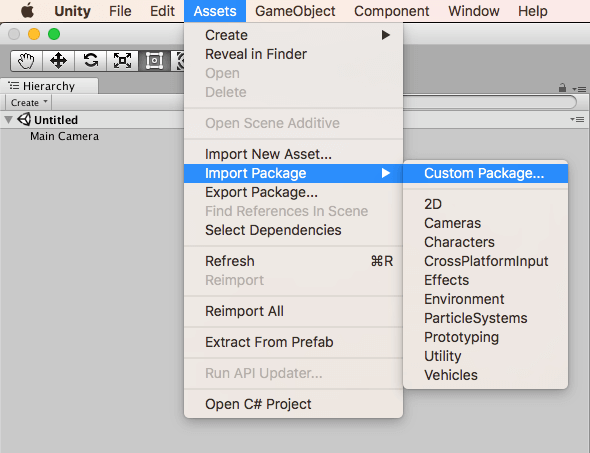
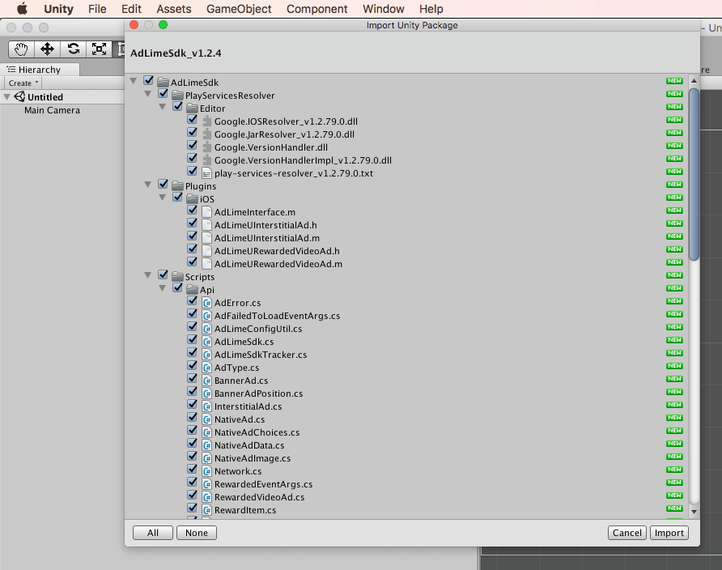
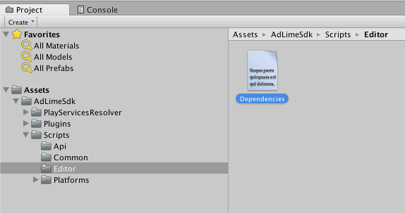
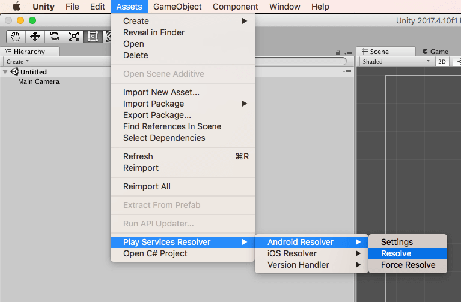
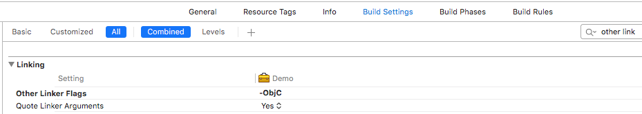
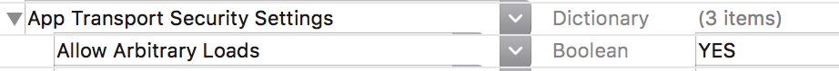

# スタートガイド
このガイドは、Unity アプリの収益化をお望みのパブリッシャー様を対象にしています。

アプリに AdLime SDK を導入することは、広告を表示して収益を獲得するための第一歩です。SDKを導入後、広告のフォーマットを選択し、該当する手順に従ってください。

## 前提条件
- Android
    - Android Studio 1.0 以降
    - Android API レベル 14 以上
- iOS
    - Xcode 9.2 以降
    - ターゲットバージョン iOS 8.0 以上
- AdLime アカウントを作成して、アプリが登録済み

## モバイル広告 Unity プラグインのダウンロード
AdLime Unity プラグインを使用すると、Unity デベロッパーは Java や Objective-C のコードを記述することなく、Android や iOS アプリで AdLime 広告を簡単に配信できます。このプラグインは、Unity プロジェクトの C# スクリプトで使用される広告をリクエストするための C# インターフェースを提供します。

下記のリンクを使って、プラグインの Unity パッケージをダウンロードしてください

[AdLimeSdk_v1.2.4.unitypackage](https://dl.bintray.com/adlime/AdLime/AdLimeSdk_v1.2.4.unitypackage)

### モバイル広告 Unity プラグインのダウンロードの導入
プロジェクトを Unity エディタで開きます。[Assets]、[Import Package]、[Custom Package] の順に選択し、ダウンロードした AdLimeSdk_v1.0.0.unitypackage ファイルを探します。



すべてのファイルを選ぶことを確認して、[Import] をクリックします。



## AdLime Unity SDKの追加
AdLime Unity プラグインは、Unity Play Services Resolver ライブラリとともに配布されます。このライブラリは、Android 固有のライブラリ（AAR など）や iOS CocoaPod にアクセスする必要がある Unity プラグインで使用するためのものです。Unity プラグインには、依存関係を宣言する機能があります。依存関係は自動的に解決され、Unity プロジェクトにコピーされます。

下記の手順でプロジェクトに AdLime SDK が含まれていることを確認してください。

### Dependencies.xmlの追加
AdLime/Scriptsの下にEditorというフォルダを作成して Dependencies.xml を作成します。これで Android と iOS の依存関係が追加できます。



### 依存関係の追加
Dependencies.xml に、以下の依存関係を追加してください。
- Android
```
<dependencies>

  <!-- Android -->
  <androidPackages>
    <!-- AdLimeSdk -->
    <androidPackage spec="com.access_company.adlime:adlime:1.9.55">
        <repositories>
            <repository>https://dl.bintray.com/adlime/AdLime</repository>
        </repositories>
    </androidPackage>
  </androidPackages>
</dependencies>
```

- iOS
```
<dependencies>
  <!-- iOS -->
  <iosPods>
    <!-- AdLimeSdk -->
    <iosPod name="AdLimeSdk" version="~> 1.6.6">
        <sources>
            <source>https://github.com/CocoaPods/Specs</source>
        </sources>
    </iosPod>
  </iosPods>

</dependencies>
```

### 依存関係の設定

- Android

    Unity エディタで、[Assets] > [Play Services Resolver] > [Android Resolver] > [Resolve] を選択します。Unity Play Services Resolver ライブラリにより、存関係が Unity アプリの Assets/Plugins/Android ディレクトリにコピーされます。

    

- iOS

    AdLime SDK を Unity に取り込むための手順はこれ以上ありません。iOS の SDK の依存関係は CocoPods によって管理します。CocoPods はビルドプロセスの最後に行われます。

    Xcode プロジェクトを導出完了後は、Build Phases > Copy Bundle Resources に AdLimeSdk.bundle が含まれていることを確認してください。

    プロジェクトのビルド設定で、以下のように [Other Linker Flags] に -ObjC を追加します。

    

    iOS 9 では、App Transport Security（ATS）というプライバシー機能が導入されました。この機能は新しいアプリでデフォルトで有効になり、安全な接続を要求します。

    広告が ATS の影響を受けないようにするには、次の作業を行ってください。

    NSAllowsArbitraryLoads の例外をアプリの Info.plist ファイルに追加して、ATS による制限を無効にします。

    

    ```objectivec
    <key>NSAppTransportSecurity</key>
    <dict>
        <key>NSAllowsArbitraryLoads</key>
        <true/>
    </dict>
    ```

## 広告フォーマットを選択する
これで AdLime SDK の導入が完了し、広告を配信できるようになりました。AdLime には様々な広告フォーマットが用意されていますので、その中からアプリのユーザー エクスペリエンスに最適なものを選択できます。

### バナー
<div class="clearfix cust-image-text">

バナー広告は、アプリのレイアウト内の一部分を使用する長方形の画像かテキストの広告です。ユーザーがアプリを操作している間は画面に残り、一定の時間が経過すると自動的に更新されます。モバイル広告を初めて利用する場合、この広告から開始するとよいでしょう。
</div>

### インタースティシャル
<div class="clearfix cust-image-text">

インタースティシャル広告は、ユーザーが閉じるまで、アプリのインターフェースを覆うようにフルスクリーンで表示される広告です。ゲームのレベルが切り替わる合間やタスクが完了した直後など、アプリの実行の流れが自然に一時停止するタイミングに使用することに適しています。
</div>

### 動画リワード
<div class="clearfix cust-image-text">

動画リワード広告は、ユーザーが動画を最後まで視聴することと引き換えに、アプリ内で報酬を獲得できるフルスクリーン動画広告です。
</div>