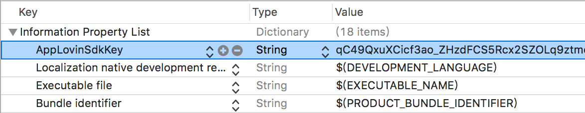

# AppLovin
- [AppLovin Webサイト](https://dash.applovin.com/)
- [AppLovin 開発ガイド](https://dash.applovin.com/docs/integration)

## 前提条件
- Android
    - Android API レベル 14 以上
- iOS
    - ターゲットバージョン iOS 9.0 以上

## SDKの導入
AdLime SDK で Applovin 広告ネットワークを使うために、Applovin SDK と、それに対応した AdLime SDK アダプタを導入してください。

### 依存関係の追加
Dependencies.xml に、下記の依存関係を追加してください。
- Android
```csharp
<dependencies>

    <!-- Android -->
    <androidPackages>

        <!-- AppLovin -->
        <androidPackage spec="com.access_company.adlime:mediation_applovin:9.11.2.0">
            <repositories>
                <repository>https://dl.bintray.com/adlime/AdLime</repository>
            </repositories>
        </androidPackage>
        <androidPackage spec="com.applovin:applovin-sdk:9.11.2">
            <repositories>
                <repository>https://jcenter.bintray.com/</repository>
            </repositories>
        </androidPackage>
        <androidPackage spec="com.google.android.gms:play-services-ads:17.2.1">
            <repositories>
                <repository>https://maven.google.com/</repository>
            </repositories>
        </androidPackage>

    </androidPackages>
</dependencies>
```

- iOS
    - Dependencies.xml の設置（推奨）
    ```csharp
    <dependencies>

        <!-- iOS -->
        <iosPods>
        
            <!-- AppLovin -->
            <iosPod name="AdLimeMediation_AppLovin" version="~> 6.9.4.0">
                <sources>
                    <source>https://github.com/CocoaPods/Specs</source>
                </sources>
            </iosPod>
        </iosPods>

    </dependencies>
    ```

    - 手動ダウンロード

    iOS プロジェクトで、 CocoaPods から SDK が ダウンロードできない場合は、 SDK を直接ダウンロードして解凍し、下記のフレームワークを Assets/Plugins/iOS に入れてください。
    
    [AppLovinSDK.framework](https://dash.applovin.com/docs/sdk/download?type=ios-main)<br>
    [AdLimeMediation_AppLovin.framework](https://github.com/Ham-mer/AdLime-iOS-Pub/raw/master/DownloadZip/AdLimeMediation_AppLovin/6.11.4.0.zip)

### 依存関係の設定
- Android

    Unity エディタで、[Assets] > [Play Services Resolver] > [Android Resolver] > [Resolve] を選択します。Unity Play Services Resolver ライブラリにより、依存関係が Unity アプリの Assets/Plugins/Android ディレクトリにコピーされます。

- iOS

    AdLime SDK を Unity に取り込むための手順はこれ以上ありません。iOS の SDK の依存関係は CocoPods によって管理します。CocoPods はビルドプロセスの最後に行われます。

    Xcode上で、プロジェクトファイルを選択し、任意のターゲットの Build Phases > Link Binary With Libraries に以下の AppLovin フレームワークを追加します。
    - AdSupport
    - AVFoundation
    - CoreGraphics
    - CoreMedia
    - CoreTelephony
    - SafariServices
    - StoreKit
    - SystemConfiguration
    - UIKit
    - WebKit
    - libz.tbd

### AppLovin SDK Keyの設置
- Android

    [APPLOVIN_KEY]に AppLovin によって割り当てられる Key を設定してください。
    ```java
    <manifest>
        <application>
            <meta-data
                android:name="applovin.sdk.key"
                android:value="[APPLOVIN_KEY]" />
        </application>
    </manifest>
    ```

    ** AppLovinに登録し， [AppLovin 管理画面](https://dash.applovin.com/docs/integration#androidIntegration)で AppLovin SDK key は取得できます。**

- iOS

    Info.plist ファイルに、 AppLovinSdkKey キーと、 AppLovin SDK Key を追加します。 [AppLovin 管理画面](https://dash.applovin.com/docs/integration#iosIntegration)で SDK Key は取得できます。

    Info.plist を ソースコードとして開いて編集します。
    ```objectivec
    <key>AppLovinSdkKey</key>
    <string>Your AppLovin SDK Key</string>
    ```

    もしくは、プロパティリストエディタ で編集できます。

    

## 広告フォーマット

### サポートフォーマット
|ネットワーク |バナー |インタースティシャル |動画リワード |
|:--------:|:----:|:---------------:|:--------:|
|AppLovin  | Y    | Y               | Y        |

### Banner サイズ
|ネットワーク   |320 × 50 |300 × 250 |320 × 100 |468 × 60 |728 × 90 |スマート |
|:--------:|:-----:|:------:|:------:|:-----:|:-----:|:----:|
|AppLovin  |Y      |Y       |        |       |       |      |

## 広告枠の設置
AdLime を使って AppLovin の広告枠を設置する前に、AppLovin の管理画面上で広告枠を作成し、その広告枠の情報を設定する必要があります。
- Zone ID

**Zone ID はオプションです**

AdLime の管理画面を開き、左側の「ネットワーク」メニューをクリックして、 Applovin を有効にしてください。

最後に、左側の「アプリ」メニューをクリックし、 Applovin を表示する広告枠で、「広告のソース追加」をクリックし、 Applovin を追加してください。

## バージョン情報

### リリースバージョン
- Android
    | AppLovin バージョン | アダプタ バージョン |
    |:------------------|:-----------------|
    | 9.9.2             | 9.9.2.0          |
    | 9.7.2             | 9.7.2.0          |
    | 8.1.4             | 8.1.4.4          |

- iOS
    | AppLovin バージョン | アダプタ バージョン |
    |:------------------|:-----------------|
    | 6.9.4             | 6.9.4.0          |
    | 6.8.0             | 6.8.0.1          |

### バージョン履歴
- Android
    | アダプタ バージョン | 日付       | 更新内容                         |
    |------------------|-----------|---------------------------------|
    |9.0.2.0           |2019-10-23 | AppLovin SDK 9.9.2 に対応|
    |9.7.2.0           |2019-7-18  | AppLovin SDK 9.7.2 に対応|
    |8.1.4.4           |2019-3-8   | バナー広告を読み込んだ直後に、AppLovin の表示イベントが実行されることによるバグの修正|

- iOS
    | アダプタ バージョン | 日付       | 更新内容                             |
    |------------------|-----------|---------------------------------|
    | 6.9.4.0          | 2019-10-14 | AppLovin SDK 6.9.4 に対応|
    | 6.8.0.1          | 2019-8-6  | NativeAdLayout インタラクティブエリアのカスタマイズに対応|
    | 6.8.0.0          | 2019-7-28 | AppLovin SDK 6.8.0 に対応|
