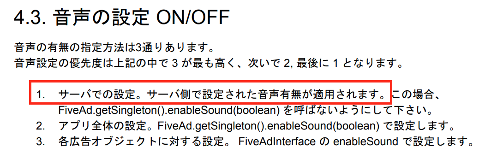

# 動画広告の音について

- 動画広告は様々なフォーマットで展示されます。例えばバナーとインタースティシャです。
- ある広告は音なくて再生されますが、ある広告は再生されるときに音が出ます。
- 音が出るか出ないかについて、あるADNWはユーザー側では調整できてあるADNWは開発者側で調整できます。

本文では、Networkを整理します。

Network：AdMob、AppLovin、Criteo、Facebook、Five、i-mobile、Maio、MoPub、Nend、Pangle、TikTok。

**開発者のコントロール**

- Api

    Some Network has Api to set video sound of Ads.

    For example AdMob:
    ```java
    // https://developers.google.com/admob/android/global-settings
    MobileAds.setAppMuted(true);
    ```

    For example Five:
    ```java
    // https://s3-ap-northeast-1.amazonaws.com/fivecdm-public/release-sdk/document/FIVE-Android-SDK-install-guide.pdf
    FiveAd.getSingleton().enableSound(true);
    ```

- web config

    For example Five:

    

**バナー**
| 番号 | Network          | ビデオ          | 音       | ユーザさんのコントロール | 開発者のコントロール |
|:---:|:----------------:|:--------------:|:--------:|:--------:|:-------------:|
| 1   | AdMob            | ◯ (web config) | mute     | ◯        | ◯ (Api)       |
| 2   | AppLovin         | ×              | ×        | ×        | ×             |
| 3   | Criteo           | ◯              | mute     | ×        | ×             |
| 4   | Facebook         | ×              | ×        | ×        | ×             |
| 5   | Five             | ◯              | sound    | ◯        | ◯ (Api & web config)|
| 6   | i-mobile         | ◯ (web config) | unknown  | ×        | ×             |
| 7   | MoPub            | ◯              | unknown  | ×        | ×             |
| 8   | Nend             | ×              | ×        | ×        | ×             |

**インタースティシャ**
| 番号 | Network          | ビデオ          | 音           | ユーザさんのコントロール | 開発者のコントロール | 音楽に対する影響(Android) |音楽に対する影響(iOS) |
|:---:|:----------------:|:--------------:|:------------:|:--------:|:-------------:|:----------------------:|:-------------------:|
| 1   | AdMob            | ◯ (web config) | unknown      | ◯        | ◯ (Api)       | 音楽が一時停止           | 音楽が一時停止         |
| 2   | AppLovin         | ◯              | sound        | x        | ◯ (Api)       | 音楽が一時停止           | 音声が同時に出る       |
| 3   | Criteo           | ×              | ×            | ×        | ×             | -                      | -                   |
| 4   | Facebook         | ◯              | mute (>=5.7.0)<br>sound (<5.7.0)| ◯ | × | 音声が同時に出る          | 音声が同時に出る      |
| 5   | Five             | ◯              | sound        | ◯        | ◯ (web config)| リクエスト失敗           | 音声が同時に出る       |
| 6   | i-mobile         | ×              | ×            | ×        | ×             | -                      | -                   |
| 7   | Maio             | ◯              | sound        | ◯        | ×             | 音楽が一時停止           | 音声が同時に出る       |
| 8   | MoPub            | ◯              | unknown      | ×        | ×             | 音が流れるような広告をリクエストできない | 音が流れるような広告をリクエストできない |
| 9   | Nend             | ◯              | mute         | ◯        | ◯ (Api)       | 音声が同時に出る          | 音声が同時に出る       |
| 10  | Pangle           | ◯              | sound        | ◯        | ×             | 音声が同時に出る          | 音声が同時に出る       |
| 11  | TikTok           | ◯              | sound        | ◯        | ×             | 音声が同時に出る          | 音声が同時に出る       |

**ネイティブ**
| 番号 | Network          | ビデオ          | 音                 | ユーザさんのコントロール | 開発者のコントロール | 音楽に対する影響(Android) | 音楽に対する影響(iOS) |
|:---:|:----------------:|:--------------:|:------------------:|:------------------:|:--------------:|:----------------------:|:-------------------:|
| 1   | AdMob            | ◯ (web config) | mute               | ◯                  | ◯ (Api)        | 音声が同時に出る         | 音声が同時に出る        |
| 2   | AppLovin         | ◯              | mute               | ×                  | ◯ (Api)        | 音声が同時に出る         | 音声が同時に出る        |
| 3   | Facebook         | ◯              | mute (normal)<br>sound (fullscreen) | x | ×              | フルスクリーンではない場合、影響はないが、フルスクリーンの場合、音楽が一時停止 | 音声が同時に出る |
| 4   | i-mobile         | ×              | ×                  | ×                  | ×              | -                      | -                   |
| 5   | Nend             | ◯              | mute (normal)<br>sound (fullscreen) | × (normal)<br>◯ (fullscreen) | × (normal)<br>◯ (fullscreen: Api) | フルスクリーンではない場合、影響はないが、フルスクリーンの場合、音楽が一時停止 | 音声が同時に出る |
| 6   | TikTok           | ◯              | mute (normal)<br>sound (fullscreen) | x | ×              | 音声が同時に出る          | 音声が同時に出る        |

sound (fullscreen)：ネイティブ広告は音なくて再生されますが、ユーザさんがクリックするとフルスクリーンで再生すると音が出ます。

**動画リワード**
| 番号 | Network          | 音            | ユーザさんのコントロール | 開発者のコントロール | 音楽に対する影響(Android) | 音楽に対する影響(iOS) |
|:---:|:----------------:|:-------------:|:--------:|:--------------:|:----------------------:|:-------------------:|
| 1   | AdMob            | sound         | ◯        | ◯              | 音楽が一時停止           | 音楽が一時停止         |
| 2   | AppLovin         | sound         | ×        | ◯              | 音楽が一時停止           | 音楽が一時停止         |
| 3   | Facebook         | mute (>=5.7.0)<br>sound (<5.7.0) | ◯ | ×  | 音声が同時に出る          | 音声が同時に出る      |
| 4   | Five             | sound         | ◯        | ◯ (web config) | リクエスト失敗           | リクエスト失敗         |
| 5   | Maio             | sound         | ◯        | ×              | 音楽が一時停止           | 音声が同時に出る       |
| 6   | MoPub            | sound         | x        | ×              | 音が流れるような広告をリクエストできない | 音が流れるような広告をリクエストできない |
| 7   | Nend             | sound         | x        | ×              | 音声が同時に出る          | 音声が同時に出る      |
| 8   | Pangle           | sound         | ◯        | ×              | 音声が同時に出る          | 音声が同時に出る      |
| 9   | TikTok           | sound         | ◯        | ×              | 音声が同時に出る          | 音声が同時に出る      |